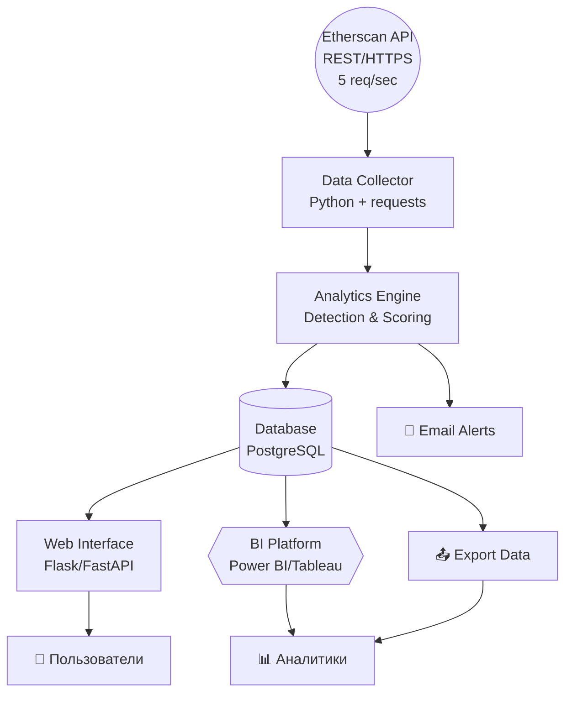

# 1. Проблема

## Описание проблемной ситуации:

В настоящее время сеть Ethereum является одной из крупнейших блокчейн-платформ с объёмом транзакций более $1 трлн в год. Однако вместе с ростом популярности криптовалют и DeFi-протоколов стремительно увеличивается количество мошеннических операций.

## Ключевые проблемы:

- **Высокий уровень криптомошенничества** — по данным Chainalysis, в 2024 году потери от мошенничества в криптосфере превысили $40 млрд

- **Отсутствие оперативного мониторинга** — существующие решения не обеспечивают анализ транзакций в реальном времени для своевременного выявления подозрительной активности

- **Сложность идентификации мошеннических схем** — традиционные методы анализа не адаптированы под специфику блокчейн-транзакций 

- **Недоступность аналитических инструментов** — большинство решений ориентированы на крупные биржи и финансовые институты, оставляя без защиты обычных пользователей и малый бизнес

## Итог:
Это приводит к значительным финансовым потерям пользователей, снижению доверия к криптовалютным технологиям и препятствует развитию цифровой экономики.

# 2 Цель и клиентский путь

# 2. Цель

## Клиентские пути  - текущее состояние (AS IS)

### Основные пользователи системы:
- Частные инвесторы и трейдеры криптовалют
- Криптовалютные биржи и обменники
- DeFi-протоколы и dApps
- Финансовые аналитики и исследователи

### Текущий путь пользователелей (AS IS):
#### 1. Частные пользователи криптовалют:
Планирует перевод → Ищет информацию об адресе (Google, форумы) → Совершает транзакцию → Обнаруживает мошенничество → Теряет средства → Обращается в поддержку → Не получает возврат ( грустный )

#### 2.Криптовалютные биржи и сервисы:
Пользователь пытается вывести средства → Проверка адреса вручную → Одобрение/блокировка транзакции → Обнаружение мошенничества постфактум → Репутационные потери → Усиление процедур KYC/AML

#### 3.Аналитики блокчейн-данных:
Получение запроса на расследование → Ручной сбор данных с Etherscan → Анализ транзакций в Excel/другие инструменты → Составление отчёта → Длительный процесс (дни/недели) → Устаревшие данные

#### 4. Регуляторные органы:
Поступление жалоб → Запрос экспертизы → Ожидание аналитических данных → Принятие решений на основе неполной информации → Запоздалые меры → Продолжение мошеннических схем

## Боли пользователей и их социально-экономические эффекты:

### Боли по группам:

**Частные пользователи:**
- Отсутствие инструментов предварительной проверки адресов
- Невозможность самостоятельной оценки рисков

**Биржи и сервисы:**
- Высокие операционные затраты на ручную проверку
- Риск регуляторных санкций за пропуск мошеннических операций

**Аналитики:**
- Отсутствие автоматизированных инструментов анализа
- Большие временные затраты на рутинные операции

**Регуляторы:**
- Недостаток оперативной аналитической информации
- Сложность мониторинга трансграничных операций

### Социально-экономические эффекты:
- Финансовые потери: более $24 млрд в год
- Снижение доверия к криптотехнологиям
- Торможение развития DeFi-экосистемы
- Репутационные риски отрасли

## Цель системы (SMART):

**Создать аналитическую систему мониторинга мошеннических операций в сети Ethereum для превентивного выявления рисков всеми категориями пользователей**

- **S (Конкретная):** Система анализа транзакций Ethereum с выявлением мошеннических паттернов
- **M (Измеримая):**
  - Создать базу из минимум 10000 проанализированных транзакций
  - Выявить и классифицировать минимум 2 типа мошеннических паттернов
  - Обеспечить время отклика системы мониторинга не более 30 секунд
  - Создать минимум 3 дашборда для визуализации данных
- **A (Достижимая):** На базе Etherscan API с использованием методов анализа данных
- **R (Релевантная):** Решает актуальную проблему криптомошенничества для всех групп пользователей
- **T (Ограниченная во времени):** Создать MVP за 4 курс

# 3. Задачи и сценарии использования (Use Cases)

## Основные задачи системы:

### Задача 1: Сбор и обработка данных
- Автоматический сбор транзакций через Etherscan API
- Парсинг и структурирование данных о транзакциях, адресах, смарт-контрактах
- Создание и поддержание базы данных мошеннических адресов
- Нормализация и валидация входящих данных

### Задача 2: Анализ и выявление паттернов
- Идентификация подозрительных транзакций по заданным критериям
- Анализ графа связей между адресами и кошельками
- Выявление типовых схем мошенничества
- Расчёт скоринга риска для адресов и транзакций

### Задача 3: Мониторинг и оповещение
- Непрерывный мониторинг новых транзакций в реальном времени
- Генерация уведомлений о подозрительной активности
- Создание и управление списками наблюдения
- Настройка пороговых значений для триггеров

### Задача 4: Визуализация и отчётность
- Создание интерактивных дашбордов для анализа трендов
- Визуализация графа связей между адресами
- Генерация аналитических отчётов и статистики
- Экспорт данных в различных форматах

## Сценарии использования (Use Cases):

### UC-01: Проверка адреса перед транзакцией
**Актор:** Частный пользователь  
**Цель:** Проверить репутацию адреса получателя  
**Сценарий:**
1. Пользователь вводит адрес получателя в систему
2. Система анализирует историю транзакций адреса
3. Система выдаёт оценку риска и рекомендации
4. Пользователь принимает решение о совершении транзакции

### UC-02: Мониторинг подозрительной активности
**Актор:** Аналитик безопасности биржи  
**Цель:** Отслеживать подозрительные операции клиентов  
**Сценарий:**
1. Аналитик настраивает правила мониторинга
2. Система непрерывно анализирует транзакции
3. При обнаружении аномалий система отправляет уведомление
4. Аналитик изучает детали и принимает меры

### UC-03: Расследование мошеннической схемы
**Актор:** Блокчейн-аналитик  
**Цель:** Проследить движение средств в мошеннической схеме  
**Сценарий:**
1. Аналитик загружает список подозрительных адресов
2. Система строит граф связанных транзакций
3. Система выделяет кластеры связанных адресов
4. Аналитик анализирует паттерны и создаёт отчёт

### UC-04: Мониторинг трендов мошенничества
**Актор:** Исследователь  
**Цель:** Анализировать тенденции в криптомошенничестве  
**Сценарий:**
1. Исследователь открывает аналитический дашборд
2. Система отображает статистику по типам мошенничества
3. Исследователь анализирует временные тренды
4. Исследователь экспортирует данные для дальнейшего анализа

### UC-05: Настройка системы мониторинга
**Актор:** Администратор системы  
**Цель:** Конфигурировать правила и пороги обнаружения  
**Сценарий:**
1. Администратор входит в панель управления
2. Администратор настраивает правила анализа
3. Система валидирует настройки
4. Система применяет новые правила к мониторингу

# 4. Архитектура системы

## 4.1 Бизнес-архитектура

### Основные бизнес-процессы:
- **Мониторинг транзакций:** Непрерывное отслеживание операций в сети Ethereum
- **Анализ рисков:** Выявление подозрительных паттернов и оценка угроз  
- **Оповещение пользователей:** Информирование о потенциальных рисках
- **Аналитическая отчётность:** Предоставление визуализации и статистики

### Ключевые участники:
- **Частные пользователи** - проверка адресов перед транзакциями
- **Биржи и сервисы** - комплаенс и управление рисками
- **Аналитики** - исследование схем мошенничества
- **Администраторы** - настройка и поддержка системы

## 4.2 Программная архитектура (C4 Model)

### Уровень 1: Контекст системы
[Пользователи] ←→ [Система мониторинга Ethereum] ←→ [Etherscan API] ↕ [Внешние источники данных]
### Уровень 2: Контейнеры системы
- **Web-приложение** - пользовательский интерфейс
- **Сервис сбора данных** - интеграция с Etherscan API
- **Аналитический движок** - обработка и анализ транзакций
- **База данных** - хранение транзакций и метаданных
- **BI-платформа** - визуализация и дашборды

### Уровень 3: Компоненты аналитического движка
*(детализируется как самый сложный и критичный для бизнес-логики контейнер)*
- Модуль парсинга
- Модуль детекции  
- Модуль скоринга

## 4.3 Аппаратная архитектура

### Минимальные требования:
- **Сервер приложений:** 4 CPU, 8GB RAM, 100GB SSD
- **База данных:** PostgreSQL с репликацией
- **Сетевое соединение:** стабильное подключение к интернету
- **Резервное копирование:** ежедневные backup'ы

## 4.4 Таблица компонентов C4

| Компонент | Технология | Назначение |
|-----------|------------|------------|
| Web App | ?? | UI для пользователей |
| Data Collector | Python + requests | Сбор данных Etherscan |
| Analytics Engine | Python + pandas | Анализ транзакций | 
| Database | PostgreSQL | Хранение данных|
| BI Platform | Superset | Визуализация |

## 4.4 Матрица архитектуры C4 + 5W

### Уровень 1: Контекст системы

| Компонент | What (Что) | Why (Зачем) | Who (Кто) | Where (Где) | When (Когда) |
|-----------|------------|-------------|-----------|-------------|--------------|
| Система мониторинга | Анализ транзакций Ethereum | Предотвращение мошенничества | Все категории пользователей | Веб-платформа | 24/7 в реальном времени |
| Etherscan API | Источник данных блокчейна | Получение транзакций | Внешний сервис | Облако Etherscan | По запросу |
| Пользователи | Потребители аналитики | Снижение рисков | Частные лица, биржи, аналитики | Веб-интерфейс | При необходимости |

### Уровень 2: Контейнеры системы

| Контейнер | What (Что) | Why (Зачем) | Who (Кто использует) | Where (Где развернут) | When (Когда активен) |
|-----------|------------|-------------|---------------------|----------------------|---------------------|
| Web-приложение | UI для взаимодействия | Удобный доступ к функциям | Конечные пользователи | Frontend сервер | Постоянно |
| Data Collector | Сбор данных Etherscan | Получение актуальных данных | Система автоматически | Background процесс | По расписанию |
| Analytics Engine | Анализ и детекция | Выявление мошенничества | Система автоматически | Compute сервер | При поступлении данных |
| Database | Хранение данных | Персистентность информации | Все компоненты | Database сервер | Постоянно |
| BI Platform | Визуализация | Представление результатов | Аналитики, менеджеры | BI сервер | По запросу |

### Уровень 3: Ключевые компоненты Analytics Engine

| Компонент | What (Что) | Why (Зачем) | Who (Кто вызывает) | Where (Где выполняется) | When (Когда срабатывает) |
|-----------|------------|-------------|-------------------|-------------------------|-------------------------|
| Модуль парсинга | Обработка JSON от API | Структурирование данных | Data Collector | Memory/CPU | При получении данных |
| Модуль детекции | Поиск паттернов мошенничества | Основная бизнес-логика | Analytics Engine | CPU интенсивно | При анализе транзакций |
| Модуль скоринга | Расчет рисков адресов | Количественная оценка | Детекция + UI запросы | CPU + Database | При запросе/обновлении |
| Модуль уведомлений | Генерация алертов | Информирование о рисках | Модуль детекции | Messaging система | При превышении порогов |
| Модуль кэширования | Сохранение частых запросов | Оптимизация производительности | Все модули | Redis/Memory | Постоянно |

**Решение:** Разделение на независимые сервисы с разными паттернами нагрузки

# 5. Взаимодействие с другими сервисами

## 5.1 Основные внешние интеграции

### Входящие интеграции (система получает данные):

| Сервис |Данные | Частота обращений | SLA требования |
|--------|--------|-------------------|----------------|
| **Etherscan API** | Транзакции, адреса, смарт-контракты, блоки | 5 запросов/сек | 99.9% uptime |

*Примечание: На начальном этапе используется только Etherscan как единственный, но надежный источник данных*

### Исходящие интеграции (система предоставляет данные)??:

| Интеграция | Назначение | Как использовать | Формат данных |
|------------|------------|------------------|---------------|
| **Export API**|Выгрузка данных | Экспорт результатов анализа для внешних аналитических систем | JSON/CSV |
  **BI-платформа** |Интерактивные дашборды и отчеты | Подключение к БД для создания дашбордов, графиков трендов, аналитических срезов | SQL queries/JSON |

## 5.3 Схема взаимодействия

