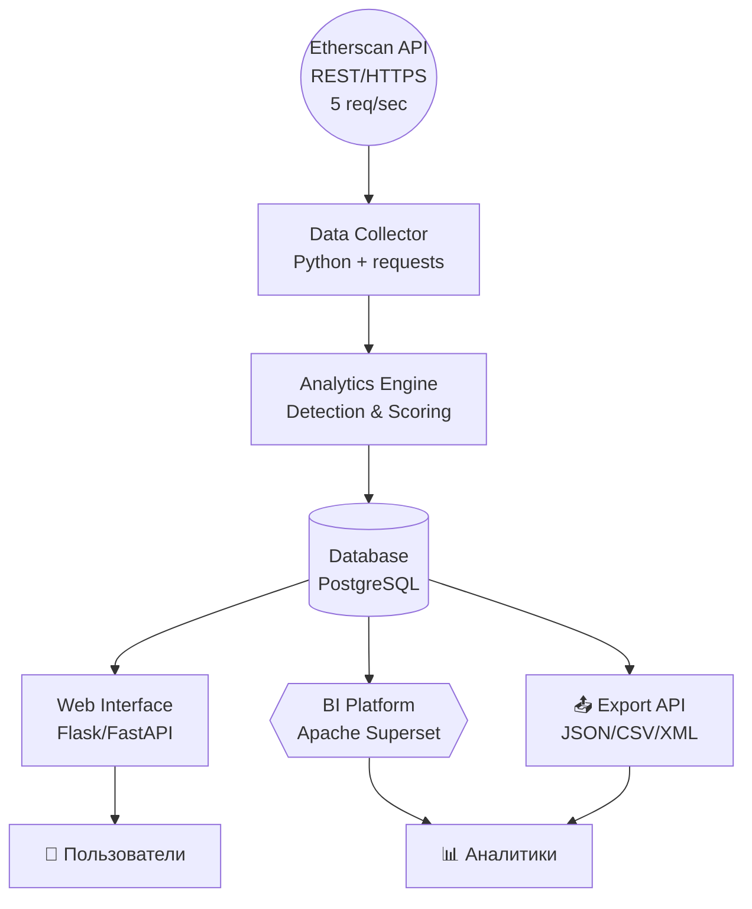

# 1. Введение

**Актуальность исследования.** Сеть Ethereum представляет собой одну из крупнейших децентрализованных блокчейн-платформ, обеспечивающую ежегодный оборот транзакций объёмом более $1 трлн. Стремительное развитие экосистемы децентрализованных финансов (DeFi), невзаимозаменяемых токенов (NFT) и децентрализованных приложений (dApps) на базе Ethereum привлекло миллионы пользователей и сотни миллиардов долларов инвестиций. Однако вместе с ростом популярности криптовалютных технологий пропорционально увеличивается масштаб мошеннической активности в сети.

Согласно данным аналитической компании Chainalysis, в 2024 году совокупный объём средств, поступивших на незаконные адреса в криптосфере, достиг $40,9 млрд, что отражает нижнюю границу оценки и свидетельствует о системном характере проблемы. Особую озабоченность вызывает тот факт, что большинство пострадавших — это обычные пользователи и представители малого бизнеса, не обладающие достаточными ресурсами для самостоятельного анализа рисков и выявления мошеннических схем.

**Проблемная ситуация.** В настоящее время существующие инструменты мониторинга блокчейн-транзакций ориентированы преимущественно на крупные криптовалютные биржи, финансовые институты и правоохранительные органы. Эти решения, как правило, являются коммерческими, дорогостоящими и недоступными для рядовых участников криптоэкономики. При этом традиционные методы финансового мониторинга, успешно применяемые в банковской сфере, оказываются малоэффективными в контексте блокчейн-технологий ввиду специфики распределённых реестров, псевдонимности участников и высокой скорости совершения транзакций.

Отсутствие оперативных систем мониторинга транзакций в режиме реального времени создаёт критический разрыв между моментом совершения мошеннических действий и их выявлением. Это приводит к невозможности своевременного предупреждения пользователей, блокировки подозрительных операций и минимизации финансового ущерба. Кроме того, сложность идентификации мошеннических паттернов в условиях огромного объёма транзакций требует применения современных методов машинного обучения и интеллектуального анализа данных, которые пока не получили широкого распространения в доступных инструментах.

**Цель и задачи работы.** Целью настоящей выпускной квалификационной работы является разработка аналитической системы мониторинга мошеннических операций в сети Ethereum, способной обеспечить оперативное выявление подозрительной активности, визуализацию данных о транзакциях и предоставление доступного инструментария для широкого круга пользователей.

**Практическая значимость работы** заключается в создании открытого решения, которое позволит повысить уровень защищённости участников криптоэкономики, укрепить доверие к технологиям блокчейн и внести вклад в формирование безопасной цифровой финансовой инфраструктуры.

# 2. Описание проблемы, цели, ограничения и приоритетные клиентские пути

## 2.1. Проблемы текущего состояния (AS IS)

Существующая система мониторинга и контроля мошеннических операций в сети Ethereum характеризуется рядом критических недостатков, препятствующих эффективной защите пользователей и развитию криптоэкономики.

**Фрагментированность инструментов анализа.** В настоящее время не существует единого доступного решения для комплексного мониторинга блокчейн-транзакций. Пользователи вынуждены обращаться к разрозненным источникам информации — обозревателям блоков (Etherscan), форумам, социальным сетям, неофициальным базам мошеннических адресов — что делает процесс проверки контрагентов трудоёмким и малоэффективным. При этом отсутствие стандартизированных методов оценки рисков приводит к субъективности выводов и высокой вероятности ошибок.

**Отсутствие оперативного мониторинга в реальном времени.** Существующие коммерческие решения (Chainalysis, Elliptic, CipherTrace) ориентированы на крупные финансовые институты и правоохранительные органы, являются дорогостоящими и недоступными для рядовых участников криптоэкономики. Частные пользователи, малые криптовалютные сервисы и исследователи не имеют возможности получать оперативные уведомления о подозрительной активности связанных с ними адресов. Это создаёт временной разрыв между совершением мошеннических действий и их обнаружением, в течение которого злоумышленники успевают вывести украденные средства и скрыться.

**Низкий уровень автоматизации анализа данных.** Традиционные методы расследования криптомошенничества основаны на ручном анализе транзакций, что требует значительных временных и человеческих ресурсов. Аналитики вынуждены вручную собирать данные с Etherscan, строить графы связей в общих инструментах (Excel, Gephi), визуализировать результаты без специализированного функционала. Процесс расследования одного инцидента может занимать от нескольких дней до недель, в течение которых данные устаревают, а мошеннические схемы продолжают функционировать.

**Сложность идентификации новых мошеннических паттернов.** Блокчейн-мошенничество постоянно эволюционирует: появляются новые схемы (rug pull, flash loan атаки, фишинговые dApps, honeypot-контракты), адаптирующиеся под существующие методы защиты. Отсутствие систем машинного обучения и интеллектуального анализа больших данных не позволяет своевременно выявлять аномальные паттерны поведения и предупреждать пользователей о новых угрозах. Существующие базы известных мошеннических адресов обновляются с запозданием и покрывают лишь малую долю реальных угроз.

**Отсутствие единого информационного пространства для обмена данными о рисках.** В экосистеме Ethereum не существует централизованного реестра мошеннических адресов и схем, доступного всем участникам. Криптовалютные биржи, DeFi-протоколы, кошельки и аналитические сервисы не имеют механизмов оперативного обмена информацией о выявленных угрозах. Это приводит к тому, что один и тот же мошеннический адрес может продолжать функционировать на разных платформах даже после обнаружения на одной из них.

**Недостаточная прозрачность для регуляторов.** Государственные органы и регуляторы финансовых рынков испытывают трудности в мониторинге криптовалютных операций ввиду псевдонимности блокчейна и отсутствия доступных инструментов анализа. Это затрудняет своевременное принятие мер по пресечению мошеннических схем, возврату украденных средств и привлечению злоумышленников к ответственности.

## 2.2. Цели концепции

**Основная цель** разработки аналитической системы мониторинга мошеннических операций в сети Ethereum заключается в создании доступного, автоматизированного и эффективного инструмента для превентивного выявления, анализа и визуализации мошеннических паттернов, обеспечивающего защиту всех категорий пользователей криптоэкономики.

Для достижения основной цели формулируются следующие конкретные задачи:

**Создание системы оперативного мониторинга транзакций.** Разработать механизм автоматизированного сбора и анализа данных о транзакциях в сети Ethereum с использованием Etherscan API, обеспечивающий выявление подозрительной активности в режиме, близком к реальному времени (время отклика системы не более 30 секунд). Система должна поддерживать непрерывный мониторинг указанных пользователем адресов и автоматическое обновление данных о новых транзакциях.

**Разработка методов идентификации мошеннических паттернов.** Внедрить алгоритмы машинного обучения и статистического анализа для выявления аномальных паттернов поведения адресов, характерных для мошеннических схем. Создать классификацию типов криптомошенничества (фишинг, Ponzi-схемы, rug pull, honeypot-контракты и др.) и обучить модели на исторических данных для автоматического распознавания этих паттернов в новых транзакциях.

**Построение единого информационного пространства данных о рисках.** Сформировать базу данных проанализированных транзакций объёмом не менее 10 000 записей с классификацией по типам активности (легитимная, подозрительная, мошенническая). Обеспечить возможность расширения базы за счёт интеграции с открытыми источниками информации о мошеннических адресах и краудсорсинговых механизмов отчётности пользователей.

**Визуализация данных и аналитическая отчётность.** Разработать интерактивные дашборды (не менее 3) для визуализации результатов анализа, включающие графы связей адресов, временные ряды активности, географическое распределение транзакций, статистику по типам мошенничества. Обеспечить возможность формирования аналитических отчётов для различных категорий пользователей — от частных инвесторов до регуляторов.

**Обеспечение доступности и масштабируемости решения.** Создать MVP системы на базе открытых технологий (Python, веб-фреймворки, библиотеки машинного обучения), доступный для широкого круга пользователей независимо от их технической квалификации и финансовых возможностей. Предусмотреть архитектуру, позволяющую масштабировать систему для обработки больших объёмов данных и интеграции с другими блокчейн-сетями в будущем.

## 2.3. Ограничения концепции

При разработке и внедрении системы мониторинга мошеннических операций необходимо учитывать ряд ограничений, накладываемых технологическими, правовыми и организационными факторами.

**Технологические ограничения.** Система базируется на публичных данных блокчейна Ethereum, получаемых через Etherscan API, что накладывает ограничения на скорость обработки запросов (rate limits) и полноту доступной информации. Анализ смарт-контрактов ограничен доступностью их исходного кода и документации. Псевдонимность блокчейна не позволяет установить реальную идентичность владельцев адресов без дополнительных источников данных. Объём исторических данных для обучения моделей машинного обучения ограничен доступностью размеченных датасетов с верифицированными мошенническими адресами.

**Правовые ограничения.** Система должна соблюдать требования законодательства о защите персональных данных (при работе с данными пользователей сервиса) и не может использоваться для деанонимизации участников блокчейна без законных оснований. Результаты автоматизированного анализа носят рекомендательный характер и не могут служить единственным основанием для блокировки транзакций или обвинений в мошенничестве без дополнительной экспертизы. Система не имеет полномочий по блокировке адресов в блокчейне или возврату средств, а может лишь информировать пользователей о рисках.

**Организационные и ресурсные ограничения.** Разработка системы ограничена временными рамками выпускной квалификационной работы (1 академический год для создания MVP). Масштаб первоначального внедрения ограничен тестовой группой пользователей и демонстрационными данными. Поддержка и развитие системы после завершения ВКР требуют организационных решений о дальнейшем финансировании и администрировании проекта.

**Ограничения точности и полноты анализа.** Эволюция мошеннических схем требует постоянного обновления алгоритмов обнаружения и баз данных угроз. Система может давать ложноположительные и ложноотрицательные результаты, что требует наличия механизмов обратной связи от пользователей и экспертной валидации. Новые, ранее неизвестные типы атак могут быть пропущены до момента их классификации и добавления в базу паттернов.

## 2.4. Приоритетные клиентские пути

### 2.4.1. Частный пользователь криптовалют

**Текущий путь (AS IS):**

Пользователь планирует отправить криптовалюту на внешний адрес → Копирует адрес получателя из сообщения, объявления или веб-сайта → Открывает кошелёк и вставляет адрес → Пытается найти информацию об адресе в Google, на форумах Reddit/Bitcointalk, проверяет отзывы → Не находит однозначной информации или тратит значительное время на поиск → Совершает транзакцию, надеясь на честность контрагента → Обнаруживает, что адрес принадлежит мошеннику (средства не поступают, сервис не предоставляется) → Пытается связаться с получателем, но не получает ответа → Обращается в поддержку биржи или правоохранительные органы → Узнаёт, что вернуть средства невозможно → Теряет деньги и доверие к криптовалютам.

**Целевой путь (TO BE):**

Пользователь планирует отправить криптовалюту → Открывает систему мониторинга мошенничества → Вводит адрес получателя в поле проверки → Система за 10-15 секунд анализирует адрес и выдаёт результат: уровень риска (низкий/средний/высокий), историю транзакций, связи с известными мошенническими адресами, типичные паттерны активности → Если риск высокий — получает чёткое предупреждение с рекомендацией не совершать транзакцию → Если риск низкий — видит подтверждение легитимности и совершает транзакцию с уверенностью → При необходимости изучает детальный отчёт с графом связей адреса → Сохраняет средства и избегает мошенничества.

**Ключевые выгоды:** превентивная защита от потери средств, экономия времени на проверку контрагентов, повышение уверенности при работе с криптовалютами, доступность инструмента без специальных знаний.

### 2.4.2. Криптовалютная биржа или обменный сервис

**Текущий путь (AS IS):**

Пользователь биржи запрашивает вывод средств на внешний адрес → Сотрудник службы безопасности вручную проверяет адрес в базе известных мошеннических адресов (если такая база ведётся) → Проверка занимает время, создавая очередь запросов на вывод → При отсутствии информации об адресе в базе транзакция одобряется по умолчанию → Средства выводятся → Через некоторое время обнаруживается, что адрес связан с мошеннической схемой или украденными средствами → Биржа получает жалобы от пользователей и претензии регуляторов → Несёт репутационные потери и риск санкций → Вынуждена усиливать процедуры KYC/AML, что замедляет сервис и снижает удобство для всех пользователей.

**Целевой путь (TO BE):**

Пользователь запрашивает вывод средств → Система биржи автоматически интегрирует запрос с системой мониторинга мошенничества через API → За 5-10 секунд получает оценку риска адреса получателя с детальным обоснованием → При высоком риске транзакция автоматически помещается на дополнительную проверку, пользователь получает уведомление с объяснением → При низком риске транзакция проходит без задержек → Служба безопасности работает только с помеченными случаями, значительно снижая нагрузку → Биржа ведёт статистику заблокированных мошеннических транзакций и предоставляет отчёты регуляторам → Повышается безопасность, скорость обслуживания и репутация сервиса.

**Ключевые выгоды:** автоматизация проверки, снижение операционных затрат, защита от регуляторных санкций, улучшение пользовательского опыта, накопление данных для комплаенса.

### 2.4.3. Аналитик блокчейн-данных / Исследователь

**Текущий путь (AS IS):**

Получает запрос на расследование инцидента мошенничества → Вручную собирает данные о транзакциях подозрительного адреса с Etherscan, копируя информацию → Экспортирует данные в Excel или записывает вручную → Строит граф связей адресов в общих инструментах визуализации (Gephi, Graphviz), не адаптированных под специфику блокчейна → Анализирует паттерны вручную, сопоставляя с известными схемами мошенничества → Составляет текстовый отчёт с приложением скриншотов и графиков → Процесс занимает от нескольких дней до недель в зависимости от сложности схемы → К моменту завершения анализа данные могут устареть, мошенники — вывести средства.

**Целевой путь (TO BE):**

Получает запрос на расследование → Открывает систему мониторинга → Вводит адрес подозрительного кошелька → Система автоматически загружает полную историю транзакций, строит интерактивный граф связей с другими адресами, выделяет аномальные паттерны → Использует встроенные фильтры для анализа транзакций по сумме, времени, типу (входящие/исходящие, взаимодействие со смарт-контрактами) → Изучает дашборд с временными рядами активности и статистикой → Получает автоматически сгенерированный отчёт с ключевыми метриками и визуализациями → Дополняет отчёт экспертными комментариями → Предоставляет заказчику детальный анализ за несколько часов вместо дней → Данные остаются актуальными, рекомендации — своевременными.

**Ключевые выгоды:** многократное сокращение времени расследования, автоматизация рутинных операций, специализированные инструменты визуализации, стандартизированная отчётность, возможность анализа большего числа кейсов.

### 2.4.4. Регулятор финансовых рынков / Правоохранительный орган

**Текущий путь (AS IS):**

Поступают жалобы от пользователей на мошенничество в криптовалютах → Запрашивается экспертиза у специализированных организаций или привлекаются сторонние аналитики → Ожидание результатов экспертизы (недели-месяцы) → Получение отчётов с неполной информацией из-за сложности анализа блокчейна → Принятие решений на основе устаревших данных → Меры принимаются с запозданием, мошенники успевают скрыться или вывести средства → Мошеннические схемы продолжают функционировать, появляются новые жертвы → Сложность координации с зарубежными регуляторами из-за трансграничного характера криптоопераций.

**Целевой путь (TO BE):**

Получают доступ к системе мониторинга как к инструменту аналитической поддержки → При поступлении жалобы оперативно проверяют подозрительные адреса в системе → Получают актуальную информацию о транзакциях, связях с другими адресами, географии активности → Используют дашборды для выявления масштаба схемы и количества вовлечённых адресов → Формируют доказательную базу на основе верифицируемых данных блокчейна → Координируют действия с другими регуляторами, предоставляя стандартизированные отчёты → Принимают оперативные меры по блокировке счетов на централизованных биржах, куда поступают мошеннические средства → Публикуют предупреждения для пользователей на основе актуальных данных → Снижают ущерб от мошенничества и повышают эффективность правоприменения.

**Ключевые выгоды:** оперативность реагирования, доказательная база для правоприменения, координация между ведомствами, превентивное информирование граждан, снижение социально-экономического ущерба.

---

## 2.5. SMART-критерии целей системы

**Specific (Конкретная):** Создать аналитическую систему для мониторинга и выявления мошеннических операций в сети Ethereum, включающую модули сбора данных через Etherscan API, анализа транзакций с применением методов машинного обучения, классификации типов мошенничества и визуализации результатов через веб-интерфейс.

**Measurable (Измеримая):**
- Сформировать базу из минимум 10 000 проанализированных транзакций с разметкой по типам активности
- Выявить и классифицировать минимум 2 типа мошеннических паттернов
- Обеспечить время отклика системы при проверке адреса не более 30 секунд
- Создать минимум 3 интерактивных дашборда для визуализации (граф связей, временные ряды, статистика по типам мошенничества)
- Достичь точности классификации (accuracy) моделей машинного обучения не менее 75% на тестовой выборке

**Achievable (Достижимая):** Реализация на базе открытых технологий (Python, библиотеки pandas, scikit-learn, visualization frameworks) и публичных данных Etherscan API. Разработка силами автора ВКР с привлечением научного руководителя для консультаций по методам анализа. Использование существующих открытых датасетов размеченных мошеннических адресов для обучения моделей.

**Relevant (Релевантная):** Система решает актуальную проблему криптомошенничества, масштаб которой превышает $40 млрд в год, и отвечает потребностям всех групп пользователей криптоэкономики — от частных инвесторов до регуляторов. Вносит вклад в повышение доверия к блокчейн-технологиям и развитие безопасной цифровой финансовой инфраструктуры.

**Time-bound (Ограниченная во времени):** Создать MVP системы в течение 4-го курса обучения (академический год 2025/2026), с поэтапной реализацией: сбор и анализ данных (1-й семестр), разработка алгоритмов классификации и веб-интерфейса (2-й семестр), тестирование и подготовка к защите ВКР (апрель-май 2026).

# 3. Общее описание архитектуры

Архитектура аналитической системы мониторинга мошеннических операций в сети Ethereum построена на принципах микросервисной организации, разделения ответственности компонентов и клиентоцентричного подхода к проектированию пользовательских сценариев. Система обеспечивает непрерывный сбор данных из блокчейна, их интеллектуальный анализ с применением методов машинного обучения и визуализацию результатов для различных категорий пользователей.

## 3.1. Функциональная архитектура

Функциональная архитектура системы организована вокруг четырёх ключевых бизнес-процессов, соответствующих основным клиентским потребностям.

**Мониторинг транзакций в режиме реального времени.** Система осуществляет непрерывное отслеживание операций в сети Ethereum путём периодических запросов к Etherscan API. Реализован механизм инкрементального обновления данных, позволяющий отслеживать новые транзакции интересующих адресов без полной перезагрузки истории. Процесс мониторинга включает сбор информации о входящих и исходящих переводах, взаимодействиях со смарт-контрактами, балансах адресов и временных характеристиках активности.

**Анализ рисков и выявление мошеннических паттернов.** Аналитический движок системы применяет комбинацию эвристических правил и моделей машинного обучения для идентификации подозрительной активности. К числу анализируемых паттернов относятся: аномально высокая частота транзакций за короткий период, множественные входящие переводы с последующим единовременным выводом средств (характерно для Ponzi-схем), взаимодействие с известными мошенническими адресами, использование миксеров и анонимизирующих сервисов, признаки фишинговых атак (имитация адресов известных сервисов). Каждому адресу присваивается количественная оценка риска (скоринг) на основе выявленных характеристик.

**Оповещение пользователей о потенциальных рисках.** При обнаружении высокого уровня риска система генерирует уведомления для пользователей, отслеживающих данный адрес или планирующих взаимодействие с ним. Механизм оповещения поддерживает различные каналы коммуникации (веб-интерфейс, email, API для интеграции с внешними системами) и настраиваемые пороги срабатывания в зависимости от предпочтений пользователя и критичности операции.

**Аналитическая отчётность и визуализация данных.** Система предоставляет интерактивные дашборды для различных категорий пользователей, включающие графы связей адресов, временные ряды активности, статистику по типам обнаруженного мошенничества, географическое распределение операций. Поддерживается экспорт данных в стандартные форматы (CSV, JSON, PDF-отчёты) для последующего анализа или предоставления регуляторам.

## 3.2. ИТ-архитектура

Система реализована на основе микросервисной архитектуры с чётким разделением функциональных обязанностей между компонентами. Архитектурное решение следует модели C4 (Context, Containers, Components, Code), что обеспечивает ясность структуры на различных уровнях детализации.

**Контекст системы.** На верхнем уровне система взаимодействует с тремя основными внешними акторами: пользователи различных категорий (частные инвесторы, биржи, аналитики, администраторы), Etherscan API как источник данных о транзакциях блокчейна Ethereum, и потенциально — внешние источники информации о мошеннических адресах (краудсорсинговые базы, репорты от бирж). Пользователи получают доступ к системе через веб-интерфейс, API или интеграционные механизмы для корпоративных клиентов.

**Уровень контейнеров.** Система состоит из пяти основных контейнеров, каждый из которых представляет отдельно развёртываемый и масштабируемый компонент:

Веб-приложение обеспечивает пользовательский интерфейс для взаимодействия с системой, реализованное как single-page application с использованием современных фреймворков. Предоставляет функции поиска и проверки адресов, просмотра детальной информации о транзакциях, настройки мониторинга и управления уведомлениями.

Сервис сбора данных (Data Collector) отвечает за интеграцию с Etherscan API, управление rate limits, кэширование запросов и обеспечение отказоустойчивости при временной недоступности внешних источников. Реализован на Python с использованием библиотеки requests и планировщика задач для периодического обновления данных.

Аналитический движок (Analytics Engine) представляет собой наиболее сложный компонент, содержащий бизнес-логику системы. Включает модули парсинга данных, детекции мошеннических паттернов, скоринга рисков, генерации уведомлений и кэширования часто запрашиваемых результатов. Реализован на Python с применением библиотек pandas для обработки данных, scikit-learn для моделей машинного обучения и Redis для кэширования.

База данных обеспечивает персистентное хранение транзакций, метаданных адресов, результатов анализа, пользовательских настроек и исторических данных для обучения моделей. Используется PostgreSQL с настроенной репликацией для обеспечения отказоустойчивости и масштабируемости чтения.

BI-платформа предоставляет инструменты визуализации и построения интерактивных дашбордов для аналитиков и корпоративных клиентов. Реализована на базе Apache Superset, интегрированного с основной базой данных системы.

**Уровень компонентов аналитического движка.** Как наиболее критичный для бизнес-логики контейнер, аналитический движок детализируется на уровне внутренних компонентов:

Модуль парсинга обрабатывает JSON-ответы от Etherscan API, валидирует данные, приводит их к внутренним структурам и обогащает метаинформацией (типы адресов, категории транзакций).

Модуль детекции применяет эвристические правила и модели машинного обучения для выявления мошеннических паттернов, сравнивает наблюдаемую активность с известными схемами, идентифицирует аномалии.

Модуль скоринга рассчитывает количественную оценку риска для каждого адреса на основе выявленных признаков, истории взаимодействий и связей с другими адресами, обеспечивает ранжирование угроз.

Модуль уведомлений генерирует алерты при превышении пороговых значений риска, управляет очередью сообщений и интегрируется с каналами доставки уведомлений пользователям.

Модуль кэширования оптимизирует производительность системы путём сохранения результатов частых запросов, снижая нагрузку на внешние API и базу данных.

## 3.3. Модель данных

Модель данных системы структурирована вокруг следующих ключевых сущностей:

**Адрес** представляет собой центральную сущность, характеризующуюся идентификатором (hash Ethereum-адреса), типом (externally owned account или contract), текущим балансом, временем первой и последней активности, репутационным скорингом и связями с другими адресами.

**Транзакция** описывает отдельную операцию в блокчейне, включая hash транзакции, адреса отправителя и получателя, сумму перевода, комиссию газа, временную метку, номер блока, статус выполнения и дополнительные данные (input data для смарт-контрактов).

**Паттерн мошенничества** содержит описание классифицированного типа мошеннической схемы (фишинг, Ponzi, rug pull и др.), характерные признаки, пороговые значения для детекции и примеры известных случаев.

**Пользователь системы** включает учётные данные, настройки мониторинга (список отслеживаемых адресов, пороги уведомлений), историю запросов и роль в системе (частный пользователь, администратор, API-клиент).

**Результат анализа** фиксирует выходные данные аналитического движка для конкретного адреса: оценку риска, список выявленных паттернов, граф связей, рекомендации по действиям и временную метку анализа.

Связи между сущностями реализованы через внешние ключи и индексы для обеспечения эффективных запросов. Применяется нормализация данных для исключения избыточности и обеспечения целостности.

## 3.4. Инфраструктура

Развёртывание системы предполагается на облачной инфраструктуре с возможностью горизонтального масштабирования компонентов в зависимости от нагрузки.

**Серверы приложений** обеспечивают работу веб-приложения, сервиса сбора данных и аналитического движка. Минимальные требования для окружения разработки и тестирования составляют 4 CPU, 8GB RAM и 100GB SSD-накопителя. Для продуктивного окружения предполагается использование контейнеризации (Docker) и оркестрации (Kubernetes) для автоматического масштабирования и управления отказоустойчивостью.

**Сервер баз данных** использует PostgreSQL с настроенной master-slave репликацией для обеспечения высокой доступности чтения и резервирования данных. Предусмотрено ежедневное резервное копирование с хранением инкрементальных бэкапов на внешних хранилищах.

**Сетевая инфраструктура** требует стабильного широкополосного подключения к интернету для обеспечения бесперебойного взаимодействия с Etherscan API и доставки уведомлений пользователям. Используются механизмы балансировки нагрузки и CDN для ускорения доставки статических ресурсов веб-интерфейса.

**Система мониторинга и логирования** обеспечивает контроль состояния всех компонентов, сбор метрик производительности, централизованное хранение логов и оповещение администраторов о критических событиях.

## 3.5. Архитектурные принципы

Проектирование системы основано на следующих ключевых принципах, обеспечивающих её надёжность, масштабируемость и сопровождаемость.

**Разделение ответственности.** Каждый компонент системы выполняет чётко определённую функцию с минимальными связями с другими компонентами. Это упрощает разработку, тестирование и замену отдельных модулей без влияния на систему в целом.

**Масштабируемость и отказоустойчивость.** Микросервисная архитектура позволяет независимо масштабировать компоненты в соответствии с их нагрузкой. Критичные сервисы (база данных, аналитический движок) имеют резервные инстансы и механизмы автоматического восстановления при сбоях.

**Стандартизация интерфейсов.** Взаимодействие между компонентами осуществляется через RESTful API с документированными контрактами, что обеспечивает возможность интеграции с внешними системами и замены компонентов без изменения остальной архитектуры.

**Клиентоцентричность.** Архитектура поддерживает различные пользовательские сценарии для разных категорий клиентов — от простой проверки адреса частным пользователем до комплексной интеграции с системами комплаенса криптобиржи.

**Открытость и расширяемость.** Система проектируется с возможностью добавления новых источников данных (другие блокчейн-сети), алгоритмов детекции, каналов интеграции и типов визуализаций без переработки базовой архитектуры.

**Производительность и эффективность использования ресурсов.** Применяются механизмы кэширования, индексирования данных, асинхронной обработки задач и пакетной загрузки для минимизации времени отклика системы и снижения нагрузки на внешние API.

**Безопасность и конфиденциальность.** Хранение пользовательских данных осуществляется с соблюдением требований законодательства о защите персональных данных. Доступ к системе осуществляется через защищённые протоколы (HTTPS), применяется аутентификация и авторизация пользователей, логирование действий для аудита.

# 4. Связность и интеграция

Архитектура системы мониторинга мошеннических операций предполагает интеграцию с внешними источниками данных и предоставление собственных интерфейсов для взаимодействия с клиентскими системами. Интеграционные решения построены на основе современных стандартов обмена данными и обеспечивают надёжное, масштабируемое взаимодействие между компонентами системы и внешними сервисами.

## 4.1. Интеграции с внешними системами

**Интеграция с Etherscan API.** Основным источником данных о транзакциях сети Ethereum выступает публичный API сервиса Etherscan, предоставляющий RESTful интерфейс для получения информации о блоках, транзакциях, адресах и смарт-контрактах. Система осуществляет регулярные запросы к следующим endpoint'ам: получение списка транзакций для указанного адреса, детальная информация о конкретной транзакции, данные о балансе адреса, информация о смарт-контрактах и их исходном коде. Частота обращений ограничена техническими требованиями провайдера и составляет не более 5 запросов в секунду для бесплатного tier'а API.

Интеграция реализована с соблюдением принципов отказоустойчивости и включает механизмы обработки временной недоступности сервиса, превышения rate limits, валидации получаемых данных и кэширования ответов для снижения нагрузки на внешний API. Система мониторинга непрерывно отслеживает доступность Etherscan API и переключается в режим работы с кэшированными данными при недоступности основного источника. Требования к уровню доступности внешнего API составляют 99.9% uptime, что соответствует допустимому времени простоя не более 8.77 часов в год.

**Интеграция с открытыми источниками данных о мошеннических адресах.** Для повышения точности детекции система интегрируется с публичными базами данных известных мошеннических адресов, поддерживаемыми криптовалютным сообществом. К числу таких источников относятся репозитории на GitHub с краудсорсинговыми списками скам-адресов, базы данных фишинговых сайтов и их связанных кошельков, отчёты исследовательских компаний о крупных инцидентах мошенничества. Интеграция осуществляется через периодическую загрузку данных в формате JSON или CSV с последующей нормализацией и включением в локальную базу знаний системы.

**Возможность интеграции с корпоративными системами.** Архитектура предусматривает возможность расширения интеграций с системами криптовалютных бирж и DeFi-протоколов для получения дополнительной контекстной информации о транзакциях и адресах. Такие интеграции могут включать данные о связи адресов с верифицированными аккаунтами, информации о заблокированных или подозрительных операциях. Реализация подобных интеграций требует заключения партнёрских соглашений в рамках развития системы.

## 4.2. Стандарты обмена данными

**RESTful API как основа интеграций.** Все внешние интеграции системы построены на основе REST архитектуры, использующей стандартные HTTP методы (GET, POST, PUT, DELETE) для взаимодействия с ресурсами. Это обеспечивает совместимость с широким спектром внешних систем и упрощает реализацию клиентских интеграций. Запросы и ответы передаются в формате JSON, что гарантирует читаемость данных как для программных систем, так и для разработчиков при отладке интеграций.

**Стандартизация форматов данных.** Система использует унифицированные схемы данных для представления ключевых сущностей: адресов Ethereum, транзакций, результатов анализа рисков, пользовательских настроек. Схемы данных документированы в формате OpenAPI (Swagger) спецификации, что позволяет автоматически генерировать клиентские библиотеки для различных языков программирования и обеспечивает контрактное взаимодействие между компонентами системы.

**Версионирование API.** Публичный API системы поддерживает версионирование через URL path (например, /api/v1/address/{hash}/risk) для обеспечения обратной совместимости при развитии функциональности. Изменения в API публикуются в соответствии с принципами semantic versioning, где major версии могут содержать breaking changes, minor версии добавляют новую функциональность без нарушения существующих интеграций, а patch версии исправляют ошибки.

## 4.3. Исходящие интеграции и API

**Export API для аналитических систем.** Система предоставляет программный интерфейс для экспорта результатов анализа во внешние аналитические системы и инструменты business intelligence. API поддерживает выгрузку данных в различных форматах: JSON для программной обработки, CSV для импорта в Excel и аналитические платформы, XML для интеграции с корпоративными системами документооборота. Экспортируемые данные включают результаты скоринга адресов, историю транзакций с аннотациями о выявленных рисках, агрегированную статистику по типам мошенничества, временные ряды активности адресов.

Реализация Export API включает механизмы пагинации для работы с большими объёмами данных, фильтрации по критериям (временной период, уровень риска, типы адресов), сортировки результатов и кэширования частых запросов. Предусмотрены rate limits для предотвращения злоупотребления ресурсами системы и мониторинг использования API для планирования масштабирования инфраструктуры.

**Интеграция с BI-платформами.** Для обеспечения интерактивной визуализации и построения аналитических дашбордов система предоставляет прямой доступ к структурированным данным в базе PostgreSQL через стандартизированные SQL-запросы. Интеграция с BI-платформами (Apache Superset, Tableau, Power BI) осуществляется через JDBC/ODBC подключения с предоставлением read-only доступа к специально подготовленным представлениям (views) данных.

Структура данных для BI-интеграции оптимизирована для аналитических запросов и включает предварительно агрегированные таблицы с метриками активности адресов по дням, статистикой обнаружения мошенничества по типам, трендами роста базы анализируемых транзакций. Это обеспечивает быстрое построение дашбордов без необходимости выполнения сложных вычислений в режиме реального времени.

**Мониторинг и логирование интеграций.** Все интеграционные взаимодействия сопровождаются подробным логированием запросов, ответов, времени выполнения, ошибок и исключительных ситуаций. Система мониторинга отслеживает доступность внешних сервисов, скорость ответов, количество успешных и неуспешных запросов, что позволяет проактивно выявлять проблемы интеграции и оптимизировать производительность.

## 4.4. Схема взаимодействия компонентов

# 5. Принципы проектирования

Разработка аналитической системы мониторинга мошеннических операций в сети Ethereum основана на ключевых архитектурных принципах, обеспечивающих создание надёжного, масштабируемого и сопровождаемого решения.

## 5.1. Принцип разделения ответственности

Архитектура системы строится на чётком разделении функциональных обязанностей между компонентами, где каждый модуль отвечает за выполнение конкретной, хорошо определённой задачи. Модуль сбора данных (Data Collector) сосредоточен исключительно на взаимодействии с Etherscan API, обработке rate limits и кэшировании запросов. Аналитический движок (Analytics Engine) выполняет только задачи обработки транзакций, выявления паттернов и скоринга рисков. Веб-интерфейс отвечает исключительно за представление данных пользователю и обработку пользовательских запросов.

Такое разделение упрощает разработку и тестирование отдельных компонентов, поскольку каждый модуль может быть протестирован изолированно. Кроме того, это облегчает сопровождение системы, так как изменения в логике одного компонента не требуют модификации других при условии сохранения интерфейсов взаимодействия.

## 5.2. Принцип слабой связанности

Компоненты системы спроектированы с минимальными зависимостями друг от друга, взаимодействуя через чётко определённые API и контракты. Веб-приложение обращается к аналитическому движку через REST API, не имея прямого доступа к внутренней логике анализа данных или структурам базы данных. Модуль сбора данных может быть заменён на альтернативную реализацию без необходимости изменения других компонентов системы.

Слабая связанность достигается через использование абстрактных интерфейсов и асинхронную обработку данных через очереди сообщений. Это позволяет компонентам работать независимо, легко масштабироваться и обрабатывать пиковые нагрузки в собственном темпе.

## 5.3. Принцип отказоустойчивости и graceful degradation

Система спроектирована для быстрого обнаружения ошибок и их обработки с минимальным влиянием на пользовательский опыт. Входящие данные от Etherscan API проходят валидацию на раннем этапе обработки, и некорректные данные отклоняются с подробным логированием, предотвращая распространение ошибок по системе.

При недоступности внешних сервисов система переходит в режим ограниченной функциональности, продолжая обслуживать пользователей на основе кэшированных данных. Веб-интерфейс предоставляет чёткую информацию о временных ограничениях, но сохраняет доступность основных функций просмотра исторических данных и экспорта результатов.

## 5.4. Принцип идемпотентности операций

Все операции системы, связанные с обработкой и сохранением данных, спроектированы как идемпотентные — повторное выполнение операции с теми же входными параметрами не изменяет конечный результат. Загрузка транзакций использует уникальные идентификаторы (transaction hash) для предотвращения дублирования записей при повторных запросах. Процесс анализа рисков может быть безопасно перезапущен при сбое без нарушения целостности данных.

Это упрощает обработку сетевых сбоев и timeout'ов, позволяя клиентским приложениям безопасно повторять запросы к API системы без риска создания дублированных данных или некорректных результатов анализа.

## 5.5. Принцип производительности и масштабируемости

Архитектурные решения ориентированы на эффективное использование вычислительных ресурсов и способность системы адаптироваться к росту объёмов данных и количества пользователей. Применение многоуровневого кэширования (результаты API запросов, предварительно вычисленные скоры рисков, агрегированная аналитика) значительно снижает нагрузку на внешние сервисы и базу данных.

Асинхронная обработка задач позволяет системе эффективно использовать ресурсы при параллельном анализе множественных адресов. Горизонтальное масштабирование компонентов обеспечивается stateless архитектурой, где каждый экземпляр сервиса может обрабатывать любые запросы без привязки к конкретным пользователям или сессиям.

## 5.6. Принцип безопасности и соответствия стандартам

Требования информационной безопасности учитываются на всех этапах проектирования системы. Все внешние интеграции осуществляются через защищённые протоколы (HTTPS/TLS) с валидацией сертификатов. Входящие данные проходят санитизацию и валидацию для предотвращения некорректной обработки.

База данных настроена с минимально необходимыми привилегиями для каждого компонента, а логирование всех операций обеспечивает аудитуемость действий. Это критично для систем, работающих с финансовыми данными и требующих высокого уровня надёжности.

# 6. Информационная безопасность

Система мониторинга мошеннических операций в сети Ethereum обрабатывает финансовые данные и требует соблюдения требований информационной безопасности.

## 6.1. Нормативные требования

Система соответствует основным требованиям российского законодательства:
- **ФЗ-152** — защита персональных данных пользователей
- **ФЗ-149** — общие требования к защите информационных систем  
- **ФЗ-115** — мониторинг подозрительных финансовых операций
- **ГОСТ Р 57580, ISO 27001** — стандарты информационной безопасности

## 6.2. Технические меры защиты

**Шифрование.** Все данные передаются по защищённым каналам HTTPS/TLS. Критичные данные в базе хранятся в зашифрованном виде (AES-256).

**Контроль доступа.** Каждый компонент имеет минимально необходимые права. Применяется ролевая модель доступа для пользователей.

**Логирование.** Ведутся журналы всех операций пользователей и системных событий для аудита и расследования инцидентов.

## 6.3. Организационные меры

- Ежедневное резервное копирование с проверкой целостности
- Регулярные обновления безопасности системы
- Мониторинг и автоматическое оповещение об инцидентах
- План реагирования на нарушения безопасности

## 6.4. Защита данных

Система обрабатывает минимум персональных данных, необходимых для работы. Данные хранятся на серверах в России. Пользователи могут запросить удаление своих данных.

Публичные данные блокчейна Ethereum не содержат личную информацию, но система обеспечивает конфиденциальность пользовательских запросов и результатов анализа.
