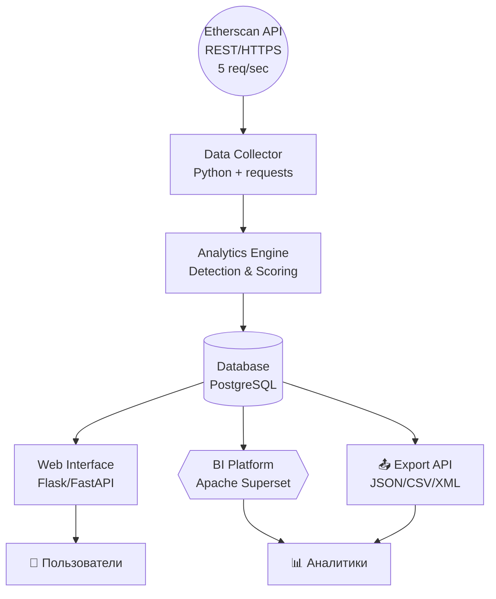

# ВВЕДЕНИЕ

## Актуальность

Блокчейн-платформа Ethereum является крупнейшей экосистемой для развертывания смарт-контрактов, обеспечивая функционирование децентрализованных финансовых приложений (DeFi), невзаимозаменяемых токенов (NFT), децентрализованных бирж (DEX) и других dApps с ежегодным оборотом, превышающим $1 трлн. По данным Etherscan, по состоянию на 2024 год в сети Ethereum развернуто более 60 миллионов смарт-контрактов, значительная часть которых представляет собой финансовые инструменты, управляющие активами на сотни миллиардов долларов.

Однако стремительный рост экосистемы сопровождается пропорциональным увеличением числа инцидентов безопасности и мошеннических схем. Согласно данным аналитической компании Chainalysis, в 2024 году совокупный объём средств, поступивших на незаконные адреса в криптосфере, достиг $40,9 млрд. Особую опасность представляют смарт-контракты, содержащие критические уязвимости (reentrancy, access control issues, integer overflow) либо специально разработанные для мошенничества (финансовые пирамиды, honeypot-схемы).

## Проблемная ситуация

Участники криптовалютной индустрии — криптобиржи, аудиторские компании, DeFi-протоколы и институциональные инвесторы — несут прямую ответственность за обеспечение безопасности пользователей, что требует постоянного мониторинга смарт-контрактов на предмет технических уязвимостей и мошеннических паттернов. В настоящее время процесс верификации смарт-контрактов осуществляется преимущественно вручную специалистами по безопасности, что влечет за собой следующие критические проблемы:

**Высокие трудозатраты:** анализ каждого смарт-контракта средней сложности требует от нескольких часов до нескольких дней работы эксперта, при этом ежедневно в сети Ethereum создается более 100 000 новых контрактов.

**Недостаточная оперативность:** ручной анализ не позволяет выявлять уязвимые контракты в режиме реального времени, что приводит к листингу скам-токенов на биржах и финансовым потерям пользователей до момента обнаружения проблемы.

**Человеческий фактор:** субъективность оценки, усталость аналитиков и недостаток автоматизированных инструментов снижают точность детектирования сложных мошеннических схем.

**Проблема масштабируемости:** существующие коммерческие решения для аудита либо чрезмерно дороги для средних и малых участников рынка, либо не обеспечивают требуемого уровня автоматизации.

### Ограничения существующих решений

Существующие инструменты статического анализа (Mythril, Slither, Securify) эффективны для выявления технических уязвимостей низкого уровня — reentrancy, integer overflow/underflow, проблем контроля доступа. Однако эти инструменты демонстрируют существенные ограничения:

**Отсутствие детектирования высокоуровневых мошеннических схем:** финансовые пирамиды, honeypot-механизмы, имитация легитимных протоколов требуют анализа бизнес-логики контрактов, а не только поиска известных паттернов уязвимостей.

**Отсутствие интегрированных решений:** большинство инструментов фокусируются либо на технических уязвимостях, либо на анализе бизнес-логики, но не объединяют оба подхода в едином инструментарии.

**Сложность интеграции:** отсутствие удобных интерфейсов (веб-интерфейс, REST API) затрудняет внедрение инструментов в процессы комплаенса и аудита.

Таким образом, существует критический разрыв между потребностями индустрии в комплексном автоматизированном анализе смарт-контрактов и возможностями существующих технологических решений.

## Цель и задачи работы

Целью настоящей научно-исследовательской работы является **разработка комплексного инструмента для автоматизированного выявления уязвимого и мошеннического кода в смарт-контрактах блокчейн-платформы Ethereum** с использованием методов статического анализа и анализа бизнес-логики через генеративные модели.

Для достижения поставленной цели необходимо решить следующие задачи:

1. **Провести исследование предметной области:** систематизировать распространенные типы уязвимостей смарт-контрактов (reentrancy, access control, integer overflow, unchecked returns, timestamp manipulation, weak randomness) и категории мошеннических схем (финансовые пирамиды, honeypot-контракты).

2. **Разработать формализованные критерии обнаружения уязвимого кода** на основе выделения характерных паттернов в исходном коде смарт-контрактов с использованием инструмента статического анализа Semgrep.

3. **Разработать формализованные критерии обнаружения мошеннического кода** на основе анализа бизнес-логики контрактов через запросы к генеративным моделям (OpenAI API).

4. **Интегрировать разработанные критерии** в программный инструмент анализа безопасности смарт-контрактов с добавлением дополнительных модулей статического анализа (Slither, Mythril) для повышения полноты покрытия.

5. **Реализовать дополнительные интерфейсы взаимодействия** (веб-интерфейс и REST API) для обеспечения доступности инструмента широкому кругу пользователей и возможности интеграции в существующие системы комплаенса.

6. **Провести апробацию разработанного инструмента** на наборах смарт-контрактов, содержащих известные уязвимости и подтвержденный мошеннический код.

## Методы исследования

В работе используются следующие методы:

- **Статический анализ кода** с использованием инструментов Semgrep (custom rules), Slither и Mythril для выявления известных паттернов уязвимостей
- **Анализ бизнес-логики через генеративные модели** (OpenAI API) для детектирования мошеннических схем, не имеющих явных кодовых паттернов
- **Эвристический анализ** для формирования правил детектирования vulnerability и fraud-паттернов
- **Формализация критериев** в виде YAML-правил (Semgrep) и структурированных промптов (OpenAI)

## Практическая значимость работы

Практическая значимость работы заключается в создании специализированного инструментария, который позволяет:

- **Криптовалютным биржам** автоматизировать процессы pre-listing аудита токенов, сократив временные затраты на верификацию с нескольких дней до минут, минимизировать риски репутационных и финансовых потерь от листинга скам-токенов.

- **Аудиторским компаниям** повысить пропускную способность анализа смарт-контрактов за счет автоматизации первичной проверки, сфокусировав ресурсы экспертов на детальном аудите наиболее критичных участков кода.

- **DeFi-протоколам и институциональным инвесторам** обеспечить независимую верификацию контрактов перед взаимодействием, снизив риски эксплуатации уязвимостей и участия в мошеннических схемах.

- **Разработчикам смарт-контрактов** получить инструмент для самостоятельной проверки кода на ранних этапах разработки, что позволит выявлять и устранять уязвимости до развертывания контрактов в mainnet.

Разработанный инструмент предоставляет как веб-интерфейс для ручного использования, так и REST API для интеграции в автоматизированные пайплайны CI/CD и системы комплаенса.

# 2. Описание проблемы, цели, ограничения и приоритетные клиентские пути

## 2.1. Проблемы текущего состояния (AS IS)

### Ограниченность возможностей существующих инструментов анализа

Современные инструменты статического анализа смарт-контрактов Ethereum (Mythril, Slither, Securify, Semgrep) демонстрируют высокую эффективность при обнаружении **низкоуровневых уязвимостей** — таких как реентерантность, переполнение буфера, ошибки контроля доступа. Однако эти инструменты не способны идентифицировать **высокоуровневые схемы мошенничества**, требующие понимания бизнес-логики и экономической модели контракта: пирамиды, honeypot-контракты, схемы pump-and-dump.

### Проблема высоких ложноположительных результатов

Существующие анализаторы генерируют значительное количество предупреждений, многие из которых являются ложноположительными или несущественными для реальной безопасности контракта. Это создает необходимость в **ручной фильтрации экспертами**, которая может занимать часы работы на один контракт, что критически снижает эффективность автоматизации и делает невозможным массовый анализ.

### Фрагментированность экосистемы инструментов

Инструменты анализа работают изолированно, без возможности **агрегации и интеграции результатов**. Отсутствует единая платформа, которая могла бы:

- Объединять выводы нескольких анализаторов
- Формировать консолидированную оценку рисков
- Предоставлять унифицированное представление результатов

Это приводит к разрозненным, трудноинтерпретируемым техническим отчетам, требующим экспертного суждения для формирования итогового вердикта о безопасности.

### Отсутствие семантического анализа бизнес-логики

Паттерн-ориентированные методы обнаружения уязвимостей оказываются неэффективными для выявления мошеннических схем, которые **варьируются в реализации кода**, но имеют схожую **экономическую логику**. Современные инструменты не анализируют:

- Семантику экономических взаимодействий
- Распределение токенов и финансовых потоков
- Логику вознаграждений и комиссий
- Условия выхода участников из системы

### Проблема масштабируемости

В сети Ethereum ежедневно развертывается **более 100 000 новых смарт-контрактов**. При этом:

- Биржи среднего размера получают тысячи запросов на листинг новых токенов
- Ресурсы экспертов-аудиторов ограничены
- Ручная проверка каждого контракта физически невозможна
- Отсутствуют автоматизированные системы быстрой первичной фильтрации

Это создает **критический разрыв** между объемом новых контрактов и возможностями их верификации, оставляя пользователей уязвимыми перед мошенническими схемами.

### Отсутствие формализованных критериев обнаружения мошенничества

В отличие от хорошо задокументированных паттернов низкоуровневых уязвимостей, **критерии идентификации сложных мошеннических схем** не формализованы и базируются на экспертной интуиции. Это ограничивает:

- Возможности автоматизации обнаружения
- Воспроизводимость результатов анализа
- Масштабирование процесса верификации
- Обучение новых специалистов

### Недостаток пользовательских интерфейсов для оперативного принятия решений

Существующие инструменты ориентированы на технических специалистов и не предоставляют:

- Интуитивно понятных дашбордов визуализации
- Автоматизированных систем скоринга рисков
- Механизмов быстрой оценки для нетехнических пользователей
- Интеграции с бизнес-процессами бирж и платформ

Это затрудняет широкое внедрение инструментов анализа в коммерческих средах с высокими объемами обработки контрактов.

## 2.2. Цели концепции

### Главная цель

Разработка **комплексного инструмента автоматизированного анализа безопасности смарт-контрактов Ethereum**, выявляющего низкоуровневые технические уязвимости и высокоуровневые мошеннические схемы с минимальным участием эксперта.

### Специфические цели

#### 1. Интеграция множественных методов анализа

Объединение результатов работы различных инструментов (Mythril, Slither, Semgrep) в единую платформу с автоматической агрегацией, нормализацией и ранжированием обнаруженных проблем по критичности.

#### 2. Внедрение семантического анализа бизнес-логики

Использование генеративных моделей для анализа экономической модели контрактов и выявления мошеннических схем: финансовых пирамид, honeypot-контрактов, скрытых механизмов извлечения средств.

#### 3. Формализация критериев обнаружения угроз

Создание воспроизводимых критериев для идентификации угроз:
- **Паттерн-ориентированные правила** (YAML-формат) для технических уязвимостей
- **Структурированные промпты** к генеративным моделям для анализа мошеннических схем

#### 4. Минимизация ложноположительных срабатываний

Снижение объема требующих ручной проверки предупреждений на **60–70%** через многоуровневую фильтрацию и контекстный анализ.

#### 5. Создание удобных пользовательских интерфейсов

Разработка **веб-интерфейса** для ручного анализа и **REST API** для интеграции в автоматизированные системы комплаенса бирж и аудиторских компаний.

#### 6. Обеспечение практической применимости

Создание готового к внедрению решения для:
- Криптобирж — автоматизация pre-listing аудита токенов
- Аудиторских компаний — ускорение первичной проверки контрактов
- DeFi-протоколов — независимая верификация перед интеграцией
- Разработчиков — самостоятельная проверка на этапе разработки

## 2.3. Ограничения концепции

### Ограничения методов статического анализа

**Невозможность выявления всех типов уязвимостей:** статический анализ основывается на паттернах известных уязвимостей и не способен обнаруживать принципиально новые типы атак или сложные композиции уязвимостей, требующих динамического анализа состояния контракта при выполнении.

### Ограничения анализа через генеративные модели

**Высокая стоимость масштабного применения:** использование коммерческих API генеративных моделей (OpenAI) для анализа тысяч контрактов влечет значительные финансовые затраты, что может ограничивать применимость инструмента для небольших организаций.

**Вероятностная природа результатов:** генеративные модели не гарантируют 100% воспроизводимости и могут давать различные интерпретации одного и того же кода при повторных запросах.

### Ограничения области применения

**Требование наличия исходного кода:** эффективный анализ возможен только при наличии верифицированного исходного кода контракта на Etherscan; анализ неверифицированных контрактов на основе байт-кода значительно менее точен.

### Ограничения точности детектирования

**Сохранение ложноположительных срабатываний:** несмотря на меры по минимизации, инструмент будет генерировать ложноположительные предупреждения, требующие финальной экспертной верификации критических случаев.

### Правовые ограничения

**Отсутствие юридических гарантий:** результаты автоматизированного анализа не являются юридически обязывающим заключением о безопасности контракта; окончательное решение о взаимодействии с контрактом остается за пользователем.

## 2.4. Приоритетные клиентские пути

### Клиентский путь №1: Специалист по комплаенсу криптобиржи

**Контекст:** Средняя криптобиржа получает 50-100 заявок на листинг новых токенов ежемесячно. Каждый токен требует обязательной проверки смарт-контракта на наличие уязвимостей и мошеннических механизмов перед допуском к торгам.

| **Этап** | **Действие пользователя** | **Проблема (AS IS)** | **Решение (TO BE)** | **Результат** |
|----------|---------------------------|----------------------|---------------------|---------------|
| **1. Получение заявки на листинг** | Специалист получает заявку с адресом смарт-контракта токена и базовой информацией о проекте | Необходимо вручную запускать несколько инструментов анализа (Mythril, Slither), интерпретировать десятки технических предупреждений, тратить 3-5 часов на один контракт | Вводит адрес контракта в веб-интерфейс инструмента или отправляет API-запрос | Инициация автоматизированного комплексного анализа |
| **2. Первичная проверка безопасности** | Оценка контракта на наличие критических технических уязвимостей | Разрозненные отчеты от разных инструментов с высоким уровнем ложноположительных срабатываний требуют экспертной фильтрации | Инструмент автоматически агрегирует результаты Mythril, Slither, Semgrep, нормализует и ранжирует проблемы по критичности | Получение консолидированного отчета о технических уязвимостях за 15-20 минут |
| **3. Проверка на мошеннические схемы** | Анализ бизнес-логики контракта на наличие скрытых механизмов обмана пользователей | Паттерн-ориентированные инструменты не выявляют высокоуровневые схемы; требуется ручной анализ экономической модели экспертом | Генеративная модель анализирует семантику контракта, выявляя признаки финансовых пирамид, honeypot-механизмов, скрытых комиссий | Автоматическое обнаружение мошеннических паттернов без глубокой экспертизы |
| **4. Принятие решения о листинге** | Формирование итогового вердикта: одобрить, отклонить или направить на детальный аудит | Субъективность оценки, риск пропуска критических проблем из-за информационной перегрузки | Получает структурированный отчет с четким указанием критичности проблем и рекомендациями | Объективное решение на основе формализованных критериев |
| **5. Интеграция в процессы биржи** | Документирование результатов проверки, интеграция с системами комплаенса | Отсутствие автоматизации: результаты копируются вручную, нет истории проверок | REST API позволяет интегрировать инструмент в автоматизированный пайплайн листинга с сохранением результатов в БД биржи | Полная автоматизация pre-listing проверки с историей аудита |

**Ключевые выгоды для биржи:**
- Сокращение времени проверки одного токена с 3-5 часов до 15-30 минут
- Снижение рисков листинга скам-токенов и репутационных потерь
- Масштабирование процесса верификации без пропорционального увеличения штата аудиторов
- Автоматизация 80% рутинных проверок с фокусом экспертов на критических случаях

---

### Клиентский путь №2: Аудитор смарт-контрактов

**Контекст:** Аудиторская компания специализируется на безопасности блокчейна и получает 20-30 запросов на аудит ежемесячно. Каждый проект требует детального анализа, подготовки отчета и взаимодействия с командой разработчиков для устранения найденных проблем. Стандартный аудит занимает 1-2 недели.

| **Этап** | **Действие пользователя** | **Проблема (AS IS)** | **Решение (TO BE)** | **Результат** |
|----------|---------------------------|----------------------|---------------------|---------------|
| **1. Прием проекта на аудит** | Аудитор получает репозиторий с кодом смарт-контрактов клиента и техническое задание на проверку | Необходимо вручную настроить окружение, запустить множество инструментов (Slither, Mythril, Echidna, Manticore), каждый со своими конфигурациями; первичный анализ занимает 8-12 часов | Загружает репозиторий через GitHub интеграцию или загружает файлы напрямую в платформу | Автоматический запуск комплексного анализа всех контрактов проекта одной командой |
| **2. Автоматизированный анализ** | Выявление технических уязвимостей, проверка на соответствие best practices, анализ паттернов атак | Каждый инструмент генерирует сотни предупреждений, 60-70% из которых ложноположительные; требуется экспертная фильтрация и категоризация, что занимает 2-3 дня | Инструмент агрегирует результаты всех анализаторов, использует ML для фильтрации ложных срабатываний, группирует проблемы по типам и критичности | Получение предварительного отчета с приоритизированными проблемами за 30-40 минут, экономия 70% времени на фильтрацию |
| **3. Глубокий экспертный анализ** | Ручная проверка бизнес-логики, анализ экономической модели, поиск специфичных для проекта уязвимостей | Аудитор должен сам изучать весь код, искать логические ошибки в токеномике, проверять математические модели; нет инструментов для автоматизации этого процесса | Генеративная модель предоставляет анализ бизнес-логики, выявляет потенциальные экономические уязвимости, генерирует контрпримеры для критических функций | Сокращение времени экспертного анализа с 5-7 дней до 2-3 дней, фокус на действительно сложных кейсах |
| **4. Подготовка отчета для клиента** | Формирование структурированного аудиторского отчета с описанием проблем, рекомендациями и уровнями критичности | Ручное составление отчета с описанием каждой проблемы, примерами кода, рекомендациями по исправлению; занимает 2-3 дня, риск человеческих ошибок | Автоматическая генерация черновика отчета с детальными описаниями проблем, фрагментами кода, рекомендациями и ссылками на стандарты безопасности | Готовый черновик отчета за 1 час, который требует только финальной экспертной проверки и брендирования |
| **5. Повторная проверка исправлений** | После устранения проблем клиентом необходимо провести ре-аудит исправленного кода | Необходимо заново запускать все инструменты, сравнивать версии кода вручную, проверять, что исправления не внесли новых проблем; занимает 1-2 дня | Инструмент автоматически сравнивает версии, показывает diff изменений, запускает анализ только измененных частей, проверяет, что все найденные проблемы действительно устранены | Ре-аудит завершается за 2-3 часа вместо 1-2 дней, автоматическая генерация финального отчета |

**Ключевые выгоды для аудиторов:**
- Увеличение пропускной способности аудиторской компании в 2-3 раза без расширения штата
- Сокращение времени стандартного аудита с 10-14 дней до 4-5 дней, повышение конкурентоспособности
- Снижение риска пропуска критических уязвимостей благодаря комплексному автоматизированному анализу
- Стандартизация процесса аудита и повышение качества отчетов для клиентов

---

### Клиентский путь №3: Разработчик смарт-контрактов

**Контекст:** Разработчик в команде DeFi-проекта пишет смарт-контракты для нового протокола. Критически важно выявлять и устранять уязвимости на ранних стадиях разработки, чтобы избежать дорогостоящих исправлений после деплоя и потенциальных взломов. Команда готовится к внешнему аудиту.

| **Этап** | **Действие пользователя** | **Проблема (AS IS)** | **Решение (TO BE)** | **Результат** |
|----------|---------------------------|----------------------|---------------------|---------------|
| **1. Разработка нового контракта** | Разработчик пишет код смарт-контракта в Solidity/Vyper, реализует бизнес-логику протокола | Безопасность проверяется только после завершения разработки перед аудитом; критические уязвимости обнаруживаются слишком поздно, исправления требуют переработки архитектуры | Интегрирует инструмент в IDE (VSCode/Remix) или в CI/CD пайплайн для автоматической проверки при каждом коммите | Проблемы безопасности выявляются в режиме реального времени во время написания кода |
| **2. Локальное тестирование** | Запуск unit-тестов и проверка основной функциональности контракта | Стандартные тесты проверяют только ожидаемое поведение, но не покрывают edge cases и потенциальные атаки; разработчик не является экспертом по безопасности | Инструмент автоматически генерирует тест-кейсы для проверки известных уязвимостей (reentrancy, overflow, access control) и выявляет проблемы | Получение немедленной обратной связи о потенциальных уязвимостях без ожидания аудита |
| **3. Peer review в команде** | Другие разработчики проводят code review, проверяют логику и ищут ошибки | Code review фокусируется на функциональности, но члены команды не всегда обладают глубокими знаниями в безопасности; критические уязвимости могут быть пропущены | Инструмент предоставляет аннотированный отчет с подсветкой потенциальных проблем безопасности для использования в процессе review | Команда получает структурированный чек-лист проблем безопасности для review, повышение качества проверки |
| **4. Подготовка к внешнему аудиту** | Команда готовит финальную версию контрактов для отправки аудиторам, хочет минимизировать количество находок | Невозможно предсказать, что найдут аудиторы; высокий риск получить длинный список проблем, что затянет сроки и увеличит стоимость аудита | Запускает полный комплексный анализ всех контрактов, получает предварительный аудиторский отчет с приоритизацией проблем | Устранение 80-90% типовых проблем до отправки на аудит, сокращение времени и стоимости внешнего аудита |
| **5. Мониторинг после деплоя** | После деплоя в mainnet необходимо отслеживать безопасность контрактов и взаимодействия с ними | Отсутствие инструментов для постоянного мониторинга; новые уязвимости могут быть обнаружены в зависимостях или паттернах взаимодействия | Подключает API для регулярного мониторинга задеплоенных контрактов, получает алерты о подозрительных транзакциях или изменениях в связанных контрактах | Проактивное обнаружение потенциальных угроз до их эксплуатации, возможность быстрого реагирования |

**Ключевые выгоды для разработчиков:**
- Shift-left подход к безопасности: выявление проблем на этапе разработки вместо дорогостоящих исправлений после аудита
- Обучение команды best practices безопасности через практическую обратную связь во время разработки
- Сокращение стоимости внешнего аудита на 30-50% благодаря предварительному устранению типовых проблем
- Снижение риска эксплойтов после запуска и защита репутации проекта и средств пользователей

---

## 2.5. SMART-критерии целей системы

**Specific (Конкретная):** Создать аналитическую систему для мониторинга и выявления мошеннических операций в сети Ethereum, включающую модули сбора данных через Etherscan API, анализа транзакций с применением методов машинного обучения, классификации типов мошенничества и визуализации результатов через веб-интерфейс.

**Measurable (Измеримая):**
- Сформировать базу из минимум 10 000 проанализированных транзакций с разметкой по типам активности
- Выявить и классифицировать минимум 2 типа мошеннических паттернов
- Обеспечить время отклика системы при проверке адреса не более 30 секунд
- Создать минимум 3 интерактивных дашборда для визуализации (граф связей, временные ряды, статистика по типам мошенничества)
- Достичь точности классификации (accuracy) моделей машинного обучения не менее 75% на тестовой выборке

**Achievable (Достижимая):** Реализация на базе открытых технологий (Python, библиотеки pandas, scikit-learn, visualization frameworks) и публичных данных Etherscan API. Разработка силами автора ВКР с привлечением научного руководителя для консультаций по методам анализа. Использование существующих открытых датасетов размеченных мошеннических адресов для обучения моделей.

**Relevant (Релевантная):** Система решает актуальную проблему криптомошенничества, масштаб которой превышает $40 млрд в год, и отвечает потребностям всех групп пользователей криптоэкономики — от частных инвесторов до регуляторов. Вносит вклад в повышение доверия к блокчейн-технологиям и развитие безопасной цифровой финансовой инфраструктуры.

**Time-bound (Ограниченная во времени):** Создать MVP системы в течение 4-го курса обучения (академический год 2025/2026), с поэтапной реализацией: сбор и анализ данных (1-й семестр), разработка алгоритмов классификации и веб-интерфейса (2-й семестр), тестирование и подготовка к защите ВКР (апрель-май 2026).

# 3. Общее описание архитектуры

Архитектура аналитической системы мониторинга мошеннических операций в сети Ethereum построена на принципах микросервисной организации, разделения ответственности компонентов и клиентоцентричного подхода к проектированию пользовательских сценариев. Система обеспечивает непрерывный сбор данных из блокчейна, их интеллектуальный анализ с применением методов машинного обучения и визуализацию результатов для различных категорий пользователей.

## 3.1. Функциональная архитектура

Функциональная архитектура системы организована вокруг четырёх ключевых бизнес-процессов, соответствующих основным клиентским потребностям.

**Мониторинг транзакций в режиме реального времени.** Система осуществляет непрерывное отслеживание операций в сети Ethereum путём периодических запросов к Etherscan API. Реализован механизм инкрементального обновления данных, позволяющий отслеживать новые транзакции интересующих адресов без полной перезагрузки истории. Процесс мониторинга включает сбор информации о входящих и исходящих переводах, взаимодействиях со смарт-контрактами, балансах адресов и временных характеристиках активности.

**Анализ рисков и выявление мошеннических паттернов.** Аналитический движок системы применяет комбинацию эвристических правил и моделей машинного обучения для идентификации подозрительной активности. К числу анализируемых паттернов относятся: аномально высокая частота транзакций за короткий период, множественные входящие переводы с последующим единовременным выводом средств (характерно для Ponzi-схем), взаимодействие с известными мошенническими адресами, использование миксеров и анонимизирующих сервисов, признаки фишинговых атак (имитация адресов известных сервисов). Каждому адресу присваивается количественная оценка риска (скоринг) на основе выявленных характеристик.

**Оповещение пользователей о потенциальных рисках.** При обнаружении высокого уровня риска система генерирует уведомления для пользователей, отслеживающих данный адрес или планирующих взаимодействие с ним. Механизм оповещения поддерживает различные каналы коммуникации (веб-интерфейс, email, API для интеграции с внешними системами) и настраиваемые пороги срабатывания в зависимости от предпочтений пользователя и критичности операции.

**Аналитическая отчётность и визуализация данных.** Система предоставляет интерактивные дашборды для различных категорий пользователей, включающие графы связей адресов, временные ряды активности, статистику по типам обнаруженного мошенничества, географическое распределение операций. Поддерживается экспорт данных в стандартные форматы (CSV, JSON, PDF-отчёты) для последующего анализа или предоставления регуляторам.

## 3.2. ИТ-архитектура

Система реализована на основе микросервисной архитектуры с чётким разделением функциональных обязанностей между компонентами. Архитектурное решение следует модели C4 (Context, Containers, Components, Code), что обеспечивает ясность структуры на различных уровнях детализации.

**Контекст системы.** На верхнем уровне система взаимодействует с тремя основными внешними акторами: пользователи различных категорий (частные инвесторы, биржи, аналитики, администраторы), Etherscan API как источник данных о транзакциях блокчейна Ethereum, и потенциально — внешние источники информации о мошеннических адресах (краудсорсинговые базы, репорты от бирж). Пользователи получают доступ к системе через веб-интерфейс, API или интеграционные механизмы для корпоративных клиентов.

**Уровень контейнеров.** Система состоит из пяти основных контейнеров, каждый из которых представляет отдельно развёртываемый и масштабируемый компонент:

Веб-приложение обеспечивает пользовательский интерфейс для взаимодействия с системой, реализованное как single-page application с использованием современных фреймворков. Предоставляет функции поиска и проверки адресов, просмотра детальной информации о транзакциях, настройки мониторинга и управления уведомлениями.

Сервис сбора данных (Data Collector) отвечает за интеграцию с Etherscan API, управление rate limits, кэширование запросов и обеспечение отказоустойчивости при временной недоступности внешних источников. Реализован на Python с использованием библиотеки requests и планировщика задач для периодического обновления данных.

Аналитический движок (Analytics Engine) представляет собой наиболее сложный компонент, содержащий бизнес-логику системы. Включает модули парсинга данных, детекции мошеннических паттернов, скоринга рисков, генерации уведомлений и кэширования часто запрашиваемых результатов. Реализован на Python с применением библиотек pandas для обработки данных, scikit-learn для моделей машинного обучения и Redis для кэширования.

База данных обеспечивает персистентное хранение транзакций, метаданных адресов, результатов анализа, пользовательских настроек и исторических данных для обучения моделей. Используется PostgreSQL с настроенной репликацией для обеспечения отказоустойчивости и масштабируемости чтения.

BI-платформа предоставляет инструменты визуализации и построения интерактивных дашбордов для аналитиков и корпоративных клиентов. Реализована на базе Apache Superset, интегрированного с основной базой данных системы.

**Уровень компонентов аналитического движка.** Как наиболее критичный для бизнес-логики контейнер, аналитический движок детализируется на уровне внутренних компонентов:

Модуль парсинга обрабатывает JSON-ответы от Etherscan API, валидирует данные, приводит их к внутренним структурам и обогащает метаинформацией (типы адресов, категории транзакций).

Модуль детекции применяет эвристические правила и модели машинного обучения для выявления мошеннических паттернов, сравнивает наблюдаемую активность с известными схемами, идентифицирует аномалии.

Модуль скоринга рассчитывает количественную оценку риска для каждого адреса на основе выявленных признаков, истории взаимодействий и связей с другими адресами, обеспечивает ранжирование угроз.

Модуль уведомлений генерирует алерты при превышении пороговых значений риска, управляет очередью сообщений и интегрируется с каналами доставки уведомлений пользователям.

Модуль кэширования оптимизирует производительность системы путём сохранения результатов частых запросов, снижая нагрузку на внешние API и базу данных.

## 3.3. Модель данных

Модель данных системы структурирована вокруг следующих ключевых сущностей:

**Адрес** представляет собой центральную сущность, характеризующуюся идентификатором (hash Ethereum-адреса), типом (externally owned account или contract), текущим балансом, временем первой и последней активности, репутационным скорингом и связями с другими адресами.

**Транзакция** описывает отдельную операцию в блокчейне, включая hash транзакции, адреса отправителя и получателя, сумму перевода, комиссию газа, временную метку, номер блока, статус выполнения и дополнительные данные (input data для смарт-контрактов).

**Паттерн мошенничества** содержит описание классифицированного типа мошеннической схемы (фишинг, Ponzi, rug pull и др.), характерные признаки, пороговые значения для детекции и примеры известных случаев.

**Пользователь системы** включает учётные данные, настройки мониторинга (список отслеживаемых адресов, пороги уведомлений), историю запросов и роль в системе (частный пользователь, администратор, API-клиент).

**Результат анализа** фиксирует выходные данные аналитического движка для конкретного адреса: оценку риска, список выявленных паттернов, граф связей, рекомендации по действиям и временную метку анализа.

Связи между сущностями реализованы через внешние ключи и индексы для обеспечения эффективных запросов. Применяется нормализация данных для исключения избыточности и обеспечения целостности.

## 3.4. Инфраструктура

Развёртывание системы предполагается на облачной инфраструктуре с возможностью горизонтального масштабирования компонентов в зависимости от нагрузки.

**Серверы приложений** обеспечивают работу веб-приложения, сервиса сбора данных и аналитического движка. Минимальные требования для окружения разработки и тестирования составляют 4 CPU, 8GB RAM и 100GB SSD-накопителя. Для продуктивного окружения предполагается использование контейнеризации (Docker) и оркестрации (Kubernetes) для автоматического масштабирования и управления отказоустойчивостью.

**Сервер баз данных** использует PostgreSQL с настроенной master-slave репликацией для обеспечения высокой доступности чтения и резервирования данных. Предусмотрено ежедневное резервное копирование с хранением инкрементальных бэкапов на внешних хранилищах.

**Сетевая инфраструктура** требует стабильного широкополосного подключения к интернету для обеспечения бесперебойного взаимодействия с Etherscan API и доставки уведомлений пользователям. Используются механизмы балансировки нагрузки и CDN для ускорения доставки статических ресурсов веб-интерфейса.

**Система мониторинга и логирования** обеспечивает контроль состояния всех компонентов, сбор метрик производительности, централизованное хранение логов и оповещение администраторов о критических событиях.

## 3.5. Архитектурные принципы

Проектирование системы основано на следующих ключевых принципах, обеспечивающих её надёжность, масштабируемость и сопровождаемость.

**Разделение ответственности.** Каждый компонент системы выполняет чётко определённую функцию с минимальными связями с другими компонентами. Это упрощает разработку, тестирование и замену отдельных модулей без влияния на систему в целом.

**Масштабируемость и отказоустойчивость.** Микросервисная архитектура позволяет независимо масштабировать компоненты в соответствии с их нагрузкой. Критичные сервисы (база данных, аналитический движок) имеют резервные инстансы и механизмы автоматического восстановления при сбоях.

**Стандартизация интерфейсов.** Взаимодействие между компонентами осуществляется через RESTful API с документированными контрактами, что обеспечивает возможность интеграции с внешними системами и замены компонентов без изменения остальной архитектуры.

**Клиентоцентричность.** Архитектура поддерживает различные пользовательские сценарии для разных категорий клиентов — от простой проверки адреса частным пользователем до комплексной интеграции с системами комплаенса криптобиржи.

**Открытость и расширяемость.** Система проектируется с возможностью добавления новых источников данных (другие блокчейн-сети), алгоритмов детекции, каналов интеграции и типов визуализаций без переработки базовой архитектуры.

**Производительность и эффективность использования ресурсов.** Применяются механизмы кэширования, индексирования данных, асинхронной обработки задач и пакетной загрузки для минимизации времени отклика системы и снижения нагрузки на внешние API.

**Безопасность и конфиденциальность.** Хранение пользовательских данных осуществляется с соблюдением требований законодательства о защите персональных данных. Доступ к системе осуществляется через защищённые протоколы (HTTPS), применяется аутентификация и авторизация пользователей, логирование действий для аудита.

# 4. Связность и интеграция

Архитектура системы мониторинга мошеннических операций предполагает интеграцию с внешними источниками данных и предоставление собственных интерфейсов для взаимодействия с клиентскими системами. Интеграционные решения построены на основе современных стандартов обмена данными и обеспечивают надёжное, масштабируемое взаимодействие между компонентами системы и внешними сервисами.

## 4.1. Интеграции с внешними системами

**Интеграция с Etherscan API.** Основным источником данных о транзакциях сети Ethereum выступает публичный API сервиса Etherscan, предоставляющий RESTful интерфейс для получения информации о блоках, транзакциях, адресах и смарт-контрактах. Система осуществляет регулярные запросы к следующим endpoint'ам: получение списка транзакций для указанного адреса, детальная информация о конкретной транзакции, данные о балансе адреса, информация о смарт-контрактах и их исходном коде. Частота обращений ограничена техническими требованиями провайдера и составляет не более 5 запросов в секунду для бесплатного tier'а API.

Интеграция реализована с соблюдением принципов отказоустойчивости и включает механизмы обработки временной недоступности сервиса, превышения rate limits, валидации получаемых данных и кэширования ответов для снижения нагрузки на внешний API. Система мониторинга непрерывно отслеживает доступность Etherscan API и переключается в режим работы с кэшированными данными при недоступности основного источника. Требования к уровню доступности внешнего API составляют 99.9% uptime, что соответствует допустимому времени простоя не более 8.77 часов в год.

**Интеграция с открытыми источниками данных о мошеннических адресах.** Для повышения точности детекции система интегрируется с публичными базами данных известных мошеннических адресов, поддерживаемыми криптовалютным сообществом. К числу таких источников относятся репозитории на GitHub с краудсорсинговыми списками скам-адресов, базы данных фишинговых сайтов и их связанных кошельков, отчёты исследовательских компаний о крупных инцидентах мошенничества. Интеграция осуществляется через периодическую загрузку данных в формате JSON или CSV с последующей нормализацией и включением в локальную базу знаний системы.

**Возможность интеграции с корпоративными системами.** Архитектура предусматривает возможность расширения интеграций с системами криптовалютных бирж и DeFi-протоколов для получения дополнительной контекстной информации о транзакциях и адресах. Такие интеграции могут включать данные о связи адресов с верифицированными аккаунтами, информации о заблокированных или подозрительных операциях. Реализация подобных интеграций требует заключения партнёрских соглашений в рамках развития системы.

## 4.2. Стандарты обмена данными

**RESTful API как основа интеграций.** Все внешние интеграции системы построены на основе REST архитектуры, использующей стандартные HTTP методы (GET, POST, PUT, DELETE) для взаимодействия с ресурсами. Это обеспечивает совместимость с широким спектром внешних систем и упрощает реализацию клиентских интеграций. Запросы и ответы передаются в формате JSON, что гарантирует читаемость данных как для программных систем, так и для разработчиков при отладке интеграций.

**Стандартизация форматов данных.** Система использует унифицированные схемы данных для представления ключевых сущностей: адресов Ethereum, транзакций, результатов анализа рисков, пользовательских настроек. Схемы данных документированы в формате OpenAPI (Swagger) спецификации, что позволяет автоматически генерировать клиентские библиотеки для различных языков программирования и обеспечивает контрактное взаимодействие между компонентами системы.

**Версионирование API.** Публичный API системы поддерживает версионирование через URL path (например, /api/v1/address/{hash}/risk) для обеспечения обратной совместимости при развитии функциональности. Изменения в API публикуются в соответствии с принципами semantic versioning, где major версии могут содержать breaking changes, minor версии добавляют новую функциональность без нарушения существующих интеграций, а patch версии исправляют ошибки.

## 4.3. Исходящие интеграции и API

**Export API для аналитических систем.** Система предоставляет программный интерфейс для экспорта результатов анализа во внешние аналитические системы и инструменты business intelligence. API поддерживает выгрузку данных в различных форматах: JSON для программной обработки, CSV для импорта в Excel и аналитические платформы, XML для интеграции с корпоративными системами документооборота. Экспортируемые данные включают результаты скоринга адресов, историю транзакций с аннотациями о выявленных рисках, агрегированную статистику по типам мошенничества, временные ряды активности адресов.

Реализация Export API включает механизмы пагинации для работы с большими объёмами данных, фильтрации по критериям (временной период, уровень риска, типы адресов), сортировки результатов и кэширования частых запросов. Предусмотрены rate limits для предотвращения злоупотребления ресурсами системы и мониторинг использования API для планирования масштабирования инфраструктуры.

**Интеграция с BI-платформами.** Для обеспечения интерактивной визуализации и построения аналитических дашбордов система предоставляет прямой доступ к структурированным данным в базе PostgreSQL через стандартизированные SQL-запросы. Интеграция с BI-платформами (Apache Superset, Tableau, Power BI) осуществляется через JDBC/ODBC подключения с предоставлением read-only доступа к специально подготовленным представлениям (views) данных.

Структура данных для BI-интеграции оптимизирована для аналитических запросов и включает предварительно агрегированные таблицы с метриками активности адресов по дням, статистикой обнаружения мошенничества по типам, трендами роста базы анализируемых транзакций. Это обеспечивает быстрое построение дашбордов без необходимости выполнения сложных вычислений в режиме реального времени.

**Мониторинг и логирование интеграций.** Все интеграционные взаимодействия сопровождаются подробным логированием запросов, ответов, времени выполнения, ошибок и исключительных ситуаций. Система мониторинга отслеживает доступность внешних сервисов, скорость ответов, количество успешных и неуспешных запросов, что позволяет проактивно выявлять проблемы интеграции и оптимизировать производительность.

## 4.4. Схема взаимодействия компонентов

# 5. Принципы проектирования

Разработка аналитической системы мониторинга мошеннических операций в сети Ethereum основана на ключевых архитектурных принципах, обеспечивающих создание надёжного, масштабируемого и сопровождаемого решения.

## 5.1. Принцип разделения ответственности

Архитектура системы строится на чётком разделении функциональных обязанностей между компонентами, где каждый модуль отвечает за выполнение конкретной, хорошо определённой задачи. Модуль сбора данных (Data Collector) сосредоточен исключительно на взаимодействии с Etherscan API, обработке rate limits и кэшировании запросов. Аналитический движок (Analytics Engine) выполняет только задачи обработки транзакций, выявления паттернов и скоринга рисков. Веб-интерфейс отвечает исключительно за представление данных пользователю и обработку пользовательских запросов.

Такое разделение упрощает разработку и тестирование отдельных компонентов, поскольку каждый модуль может быть протестирован изолированно. Кроме того, это облегчает сопровождение системы, так как изменения в логике одного компонента не требуют модификации других при условии сохранения интерфейсов взаимодействия.

## 5.2. Принцип слабой связанности

Компоненты системы спроектированы с минимальными зависимостями друг от друга, взаимодействуя через чётко определённые API и контракты. Веб-приложение обращается к аналитическому движку через REST API, не имея прямого доступа к внутренней логике анализа данных или структурам базы данных. Модуль сбора данных может быть заменён на альтернативную реализацию без необходимости изменения других компонентов системы.

Слабая связанность достигается через использование абстрактных интерфейсов и асинхронную обработку данных через очереди сообщений. Это позволяет компонентам работать независимо, легко масштабироваться и обрабатывать пиковые нагрузки в собственном темпе.

## 5.3. Принцип отказоустойчивости и graceful degradation

Система спроектирована для быстрого обнаружения ошибок и их обработки с минимальным влиянием на пользовательский опыт. Входящие данные от Etherscan API проходят валидацию на раннем этапе обработки, и некорректные данные отклоняются с подробным логированием, предотвращая распространение ошибок по системе.

При недоступности внешних сервисов система переходит в режим ограниченной функциональности, продолжая обслуживать пользователей на основе кэшированных данных. Веб-интерфейс предоставляет чёткую информацию о временных ограничениях, но сохраняет доступность основных функций просмотра исторических данных и экспорта результатов.

## 5.4. Принцип идемпотентности операций

Все операции системы, связанные с обработкой и сохранением данных, спроектированы как идемпотентные — повторное выполнение операции с теми же входными параметрами не изменяет конечный результат. Загрузка транзакций использует уникальные идентификаторы (transaction hash) для предотвращения дублирования записей при повторных запросах. Процесс анализа рисков может быть безопасно перезапущен при сбое без нарушения целостности данных.

Это упрощает обработку сетевых сбоев и timeout'ов, позволяя клиентским приложениям безопасно повторять запросы к API системы без риска создания дублированных данных или некорректных результатов анализа.

## 5.5. Принцип производительности и масштабируемости

Архитектурные решения ориентированы на эффективное использование вычислительных ресурсов и способность системы адаптироваться к росту объёмов данных и количества пользователей. Применение многоуровневого кэширования (результаты API запросов, предварительно вычисленные скоры рисков, агрегированная аналитика) значительно снижает нагрузку на внешние сервисы и базу данных.

Асинхронная обработка задач позволяет системе эффективно использовать ресурсы при параллельном анализе множественных адресов. Горизонтальное масштабирование компонентов обеспечивается stateless архитектурой, где каждый экземпляр сервиса может обрабатывать любые запросы без привязки к конкретным пользователям или сессиям.

## 5.6. Принцип безопасности и соответствия стандартам

Требования информационной безопасности учитываются на всех этапах проектирования системы. Все внешние интеграции осуществляются через защищённые протоколы (HTTPS/TLS) с валидацией сертификатов. Входящие данные проходят санитизацию и валидацию для предотвращения некорректной обработки.

База данных настроена с минимально необходимыми привилегиями для каждого компонента, а логирование всех операций обеспечивает аудитуемость действий. Это критично для систем, работающих с финансовыми данными и требующих высокого уровня надёжности.

# 6. Информационная безопасность

Система мониторинга мошеннических операций в сети Ethereum обрабатывает финансовые данные и требует соблюдения требований информационной безопасности.

## 6.1. Нормативные требования

Система соответствует основным требованиям российского законодательства:
- **ФЗ-152** — защита персональных данных пользователей
- **ФЗ-149** — общие требования к защите информационных систем  
- **ФЗ-115** — мониторинг подозрительных финансовых операций
- **ГОСТ Р 57580, ISO 27001** — стандарты информационной безопасности

## 6.2. Технические меры защиты

**Шифрование.** Все данные передаются по защищённым каналам HTTPS/TLS. Критичные данные в базе хранятся в зашифрованном виде (AES-256).

**Контроль доступа.** Каждый компонент имеет минимально необходимые права. Применяется ролевая модель доступа для пользователей.

**Логирование.** Ведутся журналы всех операций пользователей и системных событий для аудита и расследования инцидентов.

## 6.3. Организационные меры

- Ежедневное резервное копирование с проверкой целостности
- Регулярные обновления безопасности системы
- Мониторинг и автоматическое оповещение об инцидентах
- План реагирования на нарушения безопасности

## 6.4. Защита данных

Система обрабатывает минимум персональных данных, необходимых для работы. Данные хранятся на серверах в России. Пользователи могут запросить удаление своих данных.

# 7. Экономическая эффективность

Система мониторинга мошеннических операций в сети Ethereum разрабатывается как дипломный проект с потенциалом коммерциализации. Экономическая модель ориентирована на создание MVP (минимально жизнеспособного продукта) с последующим масштабированием.

## 7.1. Структура затрат на разработку

**Затраты на разработку MVP.** В рамках дипломного проекта основные затраты связаны с временными ресурсами студента (6 месяцев разработки) и минимальной инфраструктурой для тестирования. Прямые финансовые затраты на создание базовой версии системы составляют:
- Облачная инфраструктура для разработки и тестирования: 5-10 тысяч рублей в месяц
- Etherscan API (бесплатный tier до 5 запросов/сек): 0 рублей
- Домен и SSL-сертификат: 2-3 тысячи рублей в год
- Общие затраты на 6-месячный период разработки: 30-50 тысяч рублей

**Инфраструктурные расходы после запуска.** Для поддержания работы системы с небольшой пользовательской базой (до 1000 пользователей) ежемесячные расходы составят 10-15 тысяч рублей, включая хостинг, мониторинг и резервное копирование.

## 7.2. Экономическое обоснование проекта

**Предотвращение финансовых потерь пользователей.** По данным исследований, средний ущерб от криптовалютного мошенничества на одного пострадавшего составляет $7,500. Если система поможет предотвратить потери хотя бы 100 пользователям в год, экономический эффект составит $750,000 (около 75 миллионов рублей), что в тысячи раз превышает затраты на разработку.

**Автоматизация анализа рисков.** Ручная проверка одного адреса квалифицированным аналитиком занимает 30-60 минут и стоит 1000-2000 рублей. Система выполняет такой анализ за несколько секунд, обеспечивая значительную экономию времени и средств пользователей.

**Образовательная ценность.** Проект демонстрирует практическое применение знаний в области анализа данных, машинного обучения и блокчейн-технологий, что повышает профессиональную квалификацию разработчика и его конкурентоспособность на рынке труда.

## 7.3. Потенциал коммерциализации

**Freemium модель.** Базовая проверка адресов остаётся бесплатной для привлечения пользователей. Расширенные функции (детальный анализ, уведомления, история) доступны по подписке 300-500 рублей в месяц. При достижении 1000 платных пользователей месячная выручка составит 300-500 тысяч рублей.

**API для разработчиков.** Предоставление программного интерфейса для интеграции с другими сервисами по модели "pay-per-request" (1-5 рублей за запрос). Это может привлечь мелких разработчиков криптовалютных приложений.

## 7.4. Оценка окупаемости

При минимальном уровне коммерциализации (500 платных пользователей, несколько API-клиентов) месячная выручка составит 200-300 тысяч рублей. За вычетом операционных расходов (50-70 тысяч рублей в месяц) система окупит первоначальные инвестиции в течение 3-6 месяцев после запуска.

Такие показатели делают проект привлекательным для дальнейшего развития, поиска инвесторов или трудоустройства в компании, работающие с блокчейн-аналитикой.

## 7.5. Основные риски

**Технологические риски.** Изменения в API Etherscan могут потребовать адаптации системы, но при использовании бесплатного tier'а такие риски минимальны.

**Конкурентные риски.** Появление аналогичных бесплатных решений может снизить интерес пользователей, однако первенство на рынке и качественная реализация обеспечат конкурентное преимущество.

**Масштабирование.** Рост пользовательской базы потребует увеличения инфраструктурных затрат, но это будет компенсироваться ростом доходов от подписок.

Экономический анализ показывает высокую эффективность проекта даже при минимальных инвестициях, что делает его перспективным как для академических целей, так и для последующей коммерциализации.

Публичные данные блокчейна Ethereum не содержат личную информацию, но система обеспечивает конфиденциальность пользовательских запросов и результатов анализа.
